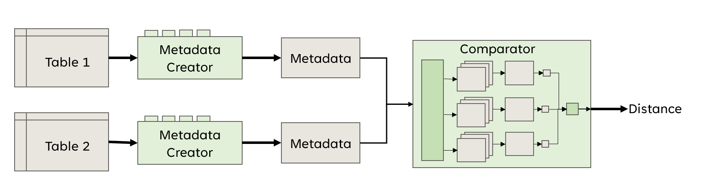

# Dataset Similarity
<!-- toc -->
- [What is Datasets Similarity?](#what-is-datasets-similarity)
  - [Approach](#approach)
  - [Column2Vec](#column2Vec)
  - [Types and Kinds](#types-and-kinds)
  - [Applicability](#applicability)
- [Structure](#structure)
- [How to run](#how-to-run)
- [How to run tests](#how-to-run-tests)
- [How to contribute](#how-to-contribute)
<!-- tocstop -->

## What is Datasets Similarity?
The Dataset Similarity project deals with the
issue of comparing tabular datasets. 
The idea of the project is that we will have a set of 
datasets that we want to compare with each other
and find out their similarity or distance.
This project mainly focuses on comparing only two tables. 
The final similarity is calculated according
to the similarity of individual columns based on their metadata. 
Columns are compared by type and by content.

For testing, we have prepared two sets of data,
the main set (training) on which the program is 
tuned, and a validation set for validating the results.

#### Definition of table similarity:

>Parameter **important columns** is user input.
> 
>Parameter **k** is also user input.


### Approach
You can see two options for implementation in the pictures below.
This implementation is only for comparing two tables.
In both implementations, we first create metadata for each table.
MetadataCreator creates the metadata and implementation of the creator
is modular.
After metadata are created for both tables, they are used as
input for Comparator.
Comparator compares metadata and it computes distance.
We should test which one is better.

1. 
2. 
#### Metadata creator
MetadataCreator has:
  - **constructor** that fills fields:
    - size
    - column_names
    - column_names_clean(lowercase, only numbers and letters) 
    - column_incomplete(if a column has more than 30 % missing values, it is marked as incomplete)
  - **Methods for set creator**
    - set_model: sets word transformer model
    - compute_column_names_embeddings: computes embeddings for clean column names
    - compute_column_kind: computes kind 
    - compute_basic_types: compute types on top level
    - compute_advanced_types: compute types on middle level
    - compute_advanced_structural_types: compute types on smaller level (user should pick only one of these 3)
    - compute_correlation: correlation between columns
    - create_column_embeddings: create embeddings for columns
  - *Getters*
    - get_column_by_type: it returns all names of columns with a specified type
    - get_numerical_columns: it returns names for all numerical columns
    - get_metadata: it is the main method. It returns created metadata.

> **Usage**:
> firstly we call constructor, then we can call any
> set methods (but for types we should pick just one),
> then we can get metadata

#### Comparator picture 1
This comparator creates several matrixes, each matrix represents a
comparison for two columns of the same type.
Matrix's could represent different aspects. 

For example, for type int we will create:
- a matrix comparing column names
- a matrix comparing max values
- a matrix comparing range
- ...

For type string we will create:
- a matrix comparing column names
- a matrix comparing embeddings
- a matrix comparing the most used word

Then we will create one matrix for string and one matrix for int by using
built-in function to unite matrix's. 

From each of these two matrixes we will compute a distance number. 
Then these distances will be merged. 
#### Comparator picture 2
This comparator will create one big matrix for all columns regardless of the type. 
Each element in the matrix will be computed from several aspects 
(for int: column names, max value, range ...). 
Then we create one number from this huge matrix, which is the distance
of these two tables. 
### Column2Vec
Column2Vec is a module in which we implement word2Vec based functionality for columns. 
It will compute embeddings for columns, so we can compare them. 
More about this module can be found [here](similarity_runner/similarity_framework/src/column2vec/README.md).
### Types and Kinds
We have decided to split columns by type. We can compute types or kinds for each column.
Types define the real type of column. Some you may know from programming languages (int, float, string)
and some are specific (human generated, word, sentence ...).
Kinds represent higher categorization.

Types have some hierarchy as you can see on picture 3. 
In the previous lines we named it: top level, middle level, smaller level. 
Explaining some types:
- Human generated: with more than three numbers after decimal point. All others are computer generated.
- word: string without a space
- sentence: string starting with an upper case letter and ending with fullstops(or ! ?). It contains only one fullstops. 
- phrase: string with more than one word
- multiple: string that represents not atomic data or structured data
- article: string with more than one sentence
3. 
Kind has only for "types" plus undefined. You can see all types on the picture 4.
Explaining kinds:
   - As **Id** will be marked column that contains only uniq values
   - As **Bool** will be marked column that contains only two unique values
   - As **Constant** will be marked column that contains only one unique value
   - As **Categorical** will be marked column that contains categories. Number of uniq values is less than threshold % of the total number of rows. Threshold is different for small and big dataset.
4. 
### Applicability
- merging teams 
- fuze of companies
- found out which data are duplicated 
- finding similar or different data
## Structure
- **Source code** is in folder [similarity](similarity). More about similarity folder structure in [README.md](similarity/README.md)
- **Source code for column2Vec** is in folder [column2Vec](similarity_runner/similarity_framework/src/column2vec).
- **Tests** are in folder [test](test)
- **Data** are stored in folders [**data**](data) and [**data_validation**](data_validation).
- **Main folder** contains: folder .github, files .gitignore, CONTRIBUTING.MD, LICENSE, README.md, requirements.txt, constants.py and main.py
- Folder **images** contains images for README.md

---

**column2Vec** folder contains all files for [column2Vec](#column2Vec) feature.
More about the structure of this folder can be found [here](similarity_runner/similarity_framework/src/column2vec/README.md/#structure).

**Datasets** for testing are stored in [**data**](data) and [**data_validation**](data_validation)
Corresponding link, name and eventual description for each dataset is
stored in DatasetDescription.md in belonging folder ([**data**](data/DatasetDescription), [**data_validation**](data_validation/DatasetDescription.md)). 
Both folders contain file DataShow.md with metadata information for each dataset ([**data**](data/DataShow.md), [**data_validation**](data_validation/DatasetDescription.md)).

## How to run
You can compare two or more tables by running main.py. 
You can use both comparator and comparatorByColumn, change the comparator in compare_datasets
The Result will be distance between tables.
```bash
 pip install -r requirements.txt
 python main.py # for fix files
 python main.py data/imdb_top_1000.csv data/netflix_titles.csv # for specific files
```
You can disable or enable warnings in main by adding these to line for disabling:
```python
warning_enable.change_status(False)
warning_enable.disable_timezone_warn()
```
Enable by:
```python
warning_enable.change_status(True)
warning_enable.enable_timezone_warn()
```
### DataShow
Is generated by file [Dataset_description](similarity/Datasets_Description.ipynb)
## How to run tests
> Tests are in folder [*test*](test). 

For running tests, you have to switch to a test folder and then run test by using pytest.
```bash
cd test

pytest types_test.py #test name to run 
```

Or you can run all the tests by running this:
```bash
 python -m unittest
 #or
 pytest
 # or for specific file
 pytest test/test_types.py 
```
**Please be aware that some tests in the test_column2Vec 
module may take a long time.**

```80 passed, 2 skipped, 500 warnings in 1887.83s (0:31:27)```

### Static tests
For static tests, we use pylint and black.
#### Pylint
You can run it by using this command:
```bash
pylint $(git ls-files '*.py')
# or for specific file
pylint similarity/metadata_creator.py
```
You can change pylint settings in [.pylintrc](.pylintrc) file.

#### Black
You can run it by using this command:
```bash
black $(git ls-files '*.py')
# or for specific file
black similarity/metadata_creator.py
```
You can change black settings in [pyproject.toml](pyproject.toml) file.


#### Coverage
You can run it by using this command:
```bash
PYTHONPATH="./similarity:./similarityRunner:$PYTHONPATH" \                      
           coverage run --source='similarity,column2Vec,similarityRunner' -m \
           pytest test/test_similarity* test/test_runner* test/test_column2VecCache.py

```

## How to contribute
Please see our [**Contribution Guidelines**](CONTRIBUTING.md).
