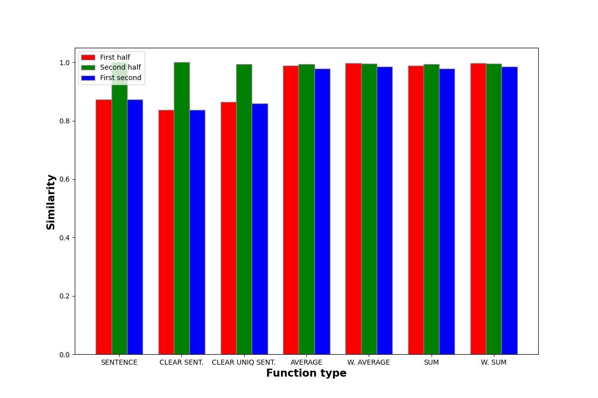

## --- Start Column: reg_state1 ---
### SENTENCE
For reg_state1:
 - whole column and first half: 0.954
 - whole column and second half: 1.0
 - first half and second half: 0.954

### CLEAR SENT.
For reg_state1:
 - whole column and first half: 0.938
 - whole column and second half: 1.0
 - first half and second half: 0.938

### CLEAR UNIQ SENT.
For reg_state1:
 - whole column and first half: 0.986
 - whole column and second half: 0.999
 - first half and second half: 0.985

### AVERAGE
For reg_state1:
 - whole column and first half: 1.0
 - whole column and second half: 0.998
 - first half and second half: 0.998

### W. AVERAGE
For reg_state1:
 - whole column and first half: F
 - whole column and second half: o
 - first half and second half: r

### SUM
For reg_state1:
 - whole column and first half: 1.0
 - whole column and second half: 0.998
 - first half and second half: 0.998

### W. SUM
For reg_state1:
 - whole column and first half: F
 - whole column and second half: o
 - first half and second half: r

## --- Start Column: reg_city1 ---
### SENTENCE
For reg_city1:
 - whole column and first half: 0.941
 - whole column and second half: 1.0
 - first half and second half: 0.941

### CLEAR SENT.
For reg_city1:
 - whole column and first half: 0.884
 - whole column and second half: 1.0
 - first half and second half: 0.884

### CLEAR UNIQ SENT.
For reg_city1:
 - whole column and first half: 0.898
 - whole column and second half: 1.0
 - first half and second half: 0.898

### AVERAGE
For reg_city1:
 - whole column and first half: 0.999
 - whole column and second half: 0.999
 - first half and second half: 0.998

### W. AVERAGE
For reg_city1:
 - whole column and first half: 1.0
 - whole column and second half: 1.0
 - first half and second half: 0.999

### SUM
For reg_city1:
 - whole column and first half: 0.999
 - whole column and second half: 0.999
 - first half and second half: 0.998

### W. SUM
For reg_city1:
 - whole column and first half: 1.0
 - whole column and second half: 1.0
 - first half and second half: 0.999

## --- Start Column: flight1 ---
### SENTENCE
For flight1:
 - whole column and first half: 0.839
 - whole column and second half: 1.0
 - first half and second half: 0.839

### CLEAR SENT.
For flight1:
 - whole column and first half: 0.88
 - whole column and second half: 1.0
 - first half and second half: 0.88

### CLEAR UNIQ SENT.
For flight1:
 - whole column and first half: 0.88
 - whole column and second half: 1.0
 - first half and second half: 0.88

### AVERAGE
For flight1:
 - whole column and first half: 0.999
 - whole column and second half: 1.0
 - first half and second half: 1.0

### W. AVERAGE
For flight1:
 - whole column and first half: F
 - whole column and second half: o
 - first half and second half: r

### SUM
For flight1:
 - whole column and first half: 0.999
 - whole column and second half: 1.0
 - first half and second half: 1.0

### W. SUM
For flight1:
 - whole column and first half: F
 - whole column and second half: o
 - first half and second half: r

## --- Start Column: tail_number1 ---
### SENTENCE
For tail_number1:
 - whole column and first half: 0.971
 - whole column and second half: 1.0
 - first half and second half: 0.971

### CLEAR SENT.
For tail_number1:
 - whole column and first half: 0.982
 - whole column and second half: 1.0
 - first half and second half: 0.982

### CLEAR UNIQ SENT.
For tail_number1:
 - whole column and first half: 0.982
 - whole column and second half: 1.0
 - first half and second half: 0.982

### AVERAGE
For tail_number1:
 - whole column and first half: F
 - whole column and second half: o
 - first half and second half: r

### W. AVERAGE
For tail_number1:
 - whole column and first half: F
 - whole column and second half: o
 - first half and second half: r

### SUM
For tail_number1:
 - whole column and first half: F
 - whole column and second half: o
 - first half and second half: r

### W. SUM
For tail_number1:
 - whole column and first half: F
 - whole column and second half: o
 - first half and second half: r

## --- Start Column: reg_expiration1 ---
### SENTENCE
For reg_expiration1:
 - whole column and first half: 0.988
 - whole column and second half: 1.0
 - first half and second half: 0.988

### CLEAR SENT.
For reg_expiration1:
 - whole column and first half: 0.97
 - whole column and second half: 1.0
 - first half and second half: 0.97

### CLEAR UNIQ SENT.
For reg_expiration1:
 - whole column and first half: 0.979
 - whole column and second half: 1.0
 - first half and second half: 0.979

### AVERAGE
For reg_expiration1:
 - whole column and first half: 0.999
 - whole column and second half: 1.0
 - first half and second half: 0.999

### W. AVERAGE
For reg_expiration1:
 - whole column and first half: F
 - whole column and second half: o
 - first half and second half: r

### SUM
For reg_expiration1:
 - whole column and first half: 0.999
 - whole column and second half: 1.0
 - first half and second half: 0.999

### W. SUM
For reg_expiration1:
 - whole column and first half: F
 - whole column and second half: o
 - first half and second half: r

## --- Start Column: reg_owner1 ---
### SENTENCE
For reg_owner1:
 - whole column and first half: 0.823
 - whole column and second half: 1.0
 - first half and second half: 0.823

### CLEAR SENT.
For reg_owner1:
 - whole column and first half: 0.893
 - whole column and second half: 1.0
 - first half and second half: 0.893

### CLEAR UNIQ SENT.
For reg_owner1:
 - whole column and first half: 0.886
 - whole column and second half: 1.0
 - first half and second half: 0.886

### AVERAGE
For reg_owner1:
 - whole column and first half: 1.0
 - whole column and second half: 0.999
 - first half and second half: 0.999

### W. AVERAGE
For reg_owner1:
 - whole column and first half: 1.0
 - whole column and second half: 1.0
 - first half and second half: 0.999

### SUM
For reg_owner1:
 - whole column and first half: 1.0
 - whole column and second half: 0.999
 - first half and second half: 0.999

### W. SUM
For reg_owner1:
 - whole column and first half: 1.0
 - whole column and second half: 1.0
 - first half and second half: 0.999

## --- Start Column: manufacturer1 ---
### SENTENCE
For manufacturer1:
 - whole column and first half: 0.92
 - whole column and second half: 1.0
 - first half and second half: 0.92

### CLEAR SENT.
For manufacturer1:
 - whole column and first half: 0.928
 - whole column and second half: 1.0
 - first half and second half: 0.928

### CLEAR UNIQ SENT.
For manufacturer1:
 - whole column and first half: 0.953
 - whole column and second half: 1.0
 - first half and second half: 0.953

### AVERAGE
For manufacturer1:
 - whole column and first half: 0.996
 - whole column and second half: 0.997
 - first half and second half: 0.996

### W. AVERAGE
For manufacturer1:
 - whole column and first half: F
 - whole column and second half: o
 - first half and second half: r

### SUM
For manufacturer1:
 - whole column and first half: 0.996
 - whole column and second half: 0.997
 - first half and second half: 0.996

### W. SUM
For manufacturer1:
 - whole column and first half: F
 - whole column and second half: o
 - first half and second half: r

## --- Start Column: model1 ---
### SENTENCE
For model1:
 - whole column and first half: 0.821
 - whole column and second half: 1.0
 - first half and second half: 0.821

### CLEAR SENT.
For model1:
 - whole column and first half: 0.875
 - whole column and second half: 1.0
 - first half and second half: 0.875

### CLEAR UNIQ SENT.
For model1:
 - whole column and first half: 0.868
 - whole column and second half: 1.0
 - first half and second half: 0.868

### AVERAGE
For model1:
 - whole column and first half: 0.999
 - whole column and second half: 0.999
 - first half and second half: 0.999

### W. AVERAGE
For model1:
 - whole column and first half: F
 - whole column and second half: o
 - first half and second half: r

### SUM
For model1:
 - whole column and first half: 0.999
 - whole column and second half: 0.999
 - first half and second half: 0.999

### W. SUM
For model1:
 - whole column and first half: F
 - whole column and second half: o
 - first half and second half: r

## --- Start Column: Multi Engine2 ---
### SENTENCE
For Multi Engine2:
 - whole column and first half: 0.965
 - whole column and second half: 1.0
 - first half and second half: 0.965

### CLEAR SENT.
For Multi Engine2:
 - whole column and first half: 0.973
 - whole column and second half: 1.0
 - first half and second half: 0.973

### CLEAR UNIQ SENT.
For Multi Engine2:
 - whole column and first half: F
 - whole column and second half: o
 - first half and second half: r

### AVERAGE
For Multi Engine2:
 - whole column and first half: F
 - whole column and second half: o
 - first half and second half: r

### W. AVERAGE
For Multi Engine2:
 - whole column and first half: F
 - whole column and second half: o
 - first half and second half: r

### SUM
For Multi Engine2:
 - whole column and first half: F
 - whole column and second half: o
 - first half and second half: r

### W. SUM
For Multi Engine2:
 - whole column and first half: F
 - whole column and second half: o
 - first half and second half: r

## --- Start Column: Engine Type2 ---
### SENTENCE
For Engine Type2:
 - whole column and first half: 0.963
 - whole column and second half: 1.0
 - first half and second half: 0.963

### CLEAR SENT.
For Engine Type2:
 - whole column and first half: 0.952
 - whole column and second half: 1.0
 - first half and second half: 0.952

### CLEAR UNIQ SENT.
For Engine Type2:
 - whole column and first half: 0.972
 - whole column and second half: 1.0
 - first half and second half: 0.972

### AVERAGE
For Engine Type2:
 - whole column and first half: F
 - whole column and second half: o
 - first half and second half: r

### W. AVERAGE
For Engine Type2:
 - whole column and first half: 1.0
 - whole column and second half: 1.0
 - first half and second half: 0.999

### SUM
For Engine Type2:
 - whole column and first half: F
 - whole column and second half: o
 - first half and second half: r

### W. SUM
For Engine Type2:
 - whole column and first half: 1.0
 - whole column and second half: 1.0
 - first half and second half: 0.999

## --- Start Column: TP mods2 ---
### SENTENCE
For TP mods2:
 - whole column and first half: F
 - whole column and second half: o
 - first half and second half: r

### CLEAR SENT.
For TP mods2:
 - whole column and first half: F
 - whole column and second half: o
 - first half and second half: r

### CLEAR UNIQ SENT.
For TP mods2:
 - whole column and first half: 1.0
 - whole column and second half: 0.928
 - first half and second half: 0.928

### AVERAGE
For TP mods2:
 - whole column and first half: 1.0
 - whole column and second half: 0.901
 - first half and second half: 0.901

### W. AVERAGE
For TP mods2:
 - whole column and first half: 0.998
 - whole column and second half: 0.998
 - first half and second half: 0.993

### SUM
For TP mods2:
 - whole column and first half: 1.0
 - whole column and second half: 0.901
 - first half and second half: 0.901

### W. SUM
For TP mods2:
 - whole column and first half: 0.998
 - whole column and second half: 0.998
 - first half and second half: 0.993

## --- Start Column: Company2 ---
### SENTENCE
For Company2:
 - whole column and first half: 0.701
 - whole column and second half: 1.0
 - first half and second half: 0.701

### CLEAR SENT.
For Company2:
 - whole column and first half: 0.611
 - whole column and second half: 1.0
 - first half and second half: 0.611

### CLEAR UNIQ SENT.
For Company2:
 - whole column and first half: 0.896
 - whole column and second half: 0.992
 - first half and second half: 0.879

### AVERAGE
For Company2:
 - whole column and first half: 0.996
 - whole column and second half: 0.977
 - first half and second half: 0.956

### W. AVERAGE
For Company2:
 - whole column and first half: 0.958
 - whole column and second half: 0.969
 - first half and second half: 0.857

### SUM
For Company2:
 - whole column and first half: 0.996
 - whole column and second half: 0.977
 - first half and second half: 0.956

### W. SUM
For Company2:
 - whole column and first half: 0.958
 - whole column and second half: 0.969
 - first half and second half: 0.857

## --- Start Column: Model2 ---
### SENTENCE
For Model2:
 - whole column and first half: 0.712
 - whole column and second half: 1.0
 - first half and second half: 0.712

### CLEAR SENT.
For Model2:
 - whole column and first half: 0.66
 - whole column and second half: 1.0
 - first half and second half: 0.66

### CLEAR UNIQ SENT.
For Model2:
 - whole column and first half: 0.66
 - whole column and second half: 1.0
 - first half and second half: 0.66

### AVERAGE
For Model2:
 - whole column and first half: 0.992
 - whole column and second half: 0.993
 - first half and second half: 0.968

### W. AVERAGE
For Model2:
 - whole column and first half: 0.992
 - whole column and second half: 0.993
 - first half and second half: 0.968

### SUM
For Model2:
 - whole column and first half: 0.992
 - whole column and second half: 0.993
 - first half and second half: 0.968

### W. SUM
For Model2:
 - whole column and first half: 0.992
 - whole column and second half: 0.993
 - first half and second half: 0.968

## --- Start Column: make3 ---
### SENTENCE
For make3:
 - whole column and first half: 0.97
 - whole column and second half: 1.0
 - first half and second half: 0.97

### CLEAR SENT.
For make3:
 - whole column and first half: 0.912
 - whole column and second half: 1.0
 - first half and second half: 0.912

### CLEAR UNIQ SENT.
For make3:
 - whole column and first half: 0.973
 - whole column and second half: 0.996
 - first half and second half: 0.969

### AVERAGE
For make3:
 - whole column and first half: 0.997
 - whole column and second half: 0.999
 - first half and second half: 0.995

### W. AVERAGE
For make3:
 - whole column and first half: F
 - whole column and second half: o
 - first half and second half: r

### SUM
For make3:
 - whole column and first half: 0.997
 - whole column and second half: 0.999
 - first half and second half: 0.995

### W. SUM
For make3:
 - whole column and first half: F
 - whole column and second half: o
 - first half and second half: r

## --- Start Column: gear3 ---
### SENTENCE
For gear3:
 - whole column and first half: 0.93
 - whole column and second half: 1.0
 - first half and second half: 0.93

### CLEAR SENT.
For gear3:
 - whole column and first half: 0.966
 - whole column and second half: 1.0
 - first half and second half: 0.966

### CLEAR UNIQ SENT.
For gear3:
 - whole column and first half: F
 - whole column and second half: o
 - first half and second half: r

### AVERAGE
For gear3:
 - whole column and first half: F
 - whole column and second half: o
 - first half and second half: r

### W. AVERAGE
For gear3:
 - whole column and first half: F
 - whole column and second half: o
 - first half and second half: r

### SUM
For gear3:
 - whole column and first half: F
 - whole column and second half: o
 - first half and second half: r

### W. SUM
For gear3:
 - whole column and first half: F
 - whole column and second half: o
 - first half and second half: r

## --- Start Column: model3 ---
### SENTENCE
For model3:
 - whole column and first half: 0.688
 - whole column and second half: 1.0
 - first half and second half: 0.688

### CLEAR SENT.
For model3:
 - whole column and first half: 0.648
 - whole column and second half: 1.0
 - first half and second half: 0.648

### CLEAR UNIQ SENT.
For model3:
 - whole column and first half: 0.762
 - whole column and second half: 1.0
 - first half and second half: 0.762

### AVERAGE
For model3:
 - whole column and first half: 0.999
 - whole column and second half: 1.0
 - first half and second half: 0.999

### W. AVERAGE
For model3:
 - whole column and first half: 1.0
 - whole column and second half: 1.0
 - first half and second half: 0.999

### SUM
For model3:
 - whole column and first half: 0.999
 - whole column and second half: 1.0
 - first half and second half: 0.999

### W. SUM
For model3:
 - whole column and first half: 1.0
 - whole column and second half: 1.0
 - first half and second half: 0.999

## --- Start Column: offerType3 ---
### SENTENCE
For offerType3:
 - whole column and first half: 0.782
 - whole column and second half: 1.0
 - first half and second half: 0.782

### CLEAR SENT.
For offerType3:
 - whole column and first half: 0.739
 - whole column and second half: 1.0
 - first half and second half: 0.739

### CLEAR UNIQ SENT.
For offerType3:
 - whole column and first half: 0.985
 - whole column and second half: 0.956
 - first half and second half: 0.96

### AVERAGE
For offerType3:
 - whole column and first half: 1.0
 - whole column and second half: 0.957
 - first half and second half: 0.957

### W. AVERAGE
For offerType3:
 - whole column and first half: F
 - whole column and second half: o
 - first half and second half: r

### SUM
For offerType3:
 - whole column and first half: 1.0
 - whole column and second half: 0.957
 - first half and second half: 0.957

### W. SUM
For offerType3:
 - whole column and first half: F
 - whole column and second half: o
 - first half and second half: r

## --- Start Column: fuel3 ---
### SENTENCE
For fuel3:
 - whole column and first half: 0.997
 - whole column and second half: 1.0
 - first half and second half: 0.997

### CLEAR SENT.
For fuel3:
 - whole column and first half: 0.995
 - whole column and second half: 1.0
 - first half and second half: 0.995

### CLEAR UNIQ SENT.
For fuel3:
 - whole column and first half: 0.991
 - whole column and second half: 1.0
 - first half and second half: 0.991

### AVERAGE
For fuel3:
 - whole column and first half: F
 - whole column and second half: o
 - first half and second half: r

### W. AVERAGE
For fuel3:
 - whole column and first half: F
 - whole column and second half: o
 - first half and second half: r

### SUM
For fuel3:
 - whole column and first half: F
 - whole column and second half: o
 - first half and second half: r

### W. SUM
For fuel3:
 - whole column and first half: F
 - whole column and second half: o
 - first half and second half: r

## --- Start Column: fuel_type4 ---
### SENTENCE
For fuel_type4:
 - whole column and first half: 0.975
 - whole column and second half: 1.0
 - first half and second half: 0.975

### CLEAR SENT.
For fuel_type4:
 - whole column and first half: 0.961
 - whole column and second half: 0.996
 - first half and second half: 0.968

### CLEAR UNIQ SENT.
For fuel_type4:
 - whole column and first half: 0.993
 - whole column and second half: 1.0
 - first half and second half: 0.993

### AVERAGE
For fuel_type4:
 - whole column and first half: F
 - whole column and second half: o
 - first half and second half: r

### W. AVERAGE
For fuel_type4:
 - whole column and first half: 0.999
 - whole column and second half: 0.999
 - first half and second half: 0.995

### SUM
For fuel_type4:
 - whole column and first half: F
 - whole column and second half: o
 - first half and second half: r

### W. SUM
For fuel_type4:
 - whole column and first half: 0.999
 - whole column and second half: 0.999
 - first half and second half: 0.995

## --- Start Column: transmission_type4 ---
### SENTENCE
For transmission_type4:
 - whole column and first half: 0.991
 - whole column and second half: 1.0
 - first half and second half: 0.991

### CLEAR SENT.
For transmission_type4:
 - whole column and first half: 0.994
 - whole column and second half: 0.998
 - first half and second half: 0.994

### CLEAR UNIQ SENT.
For transmission_type4:
 - whole column and first half: 0.977
 - whole column and second half: 1.0
 - first half and second half: 0.977

### AVERAGE
For transmission_type4:
 - whole column and first half: F
 - whole column and second half: o
 - first half and second half: r

### W. AVERAGE
For transmission_type4:
 - whole column and first half: 0.999
 - whole column and second half: 0.999
 - first half and second half: 0.997

### SUM
For transmission_type4:
 - whole column and first half: F
 - whole column and second half: o
 - first half and second half: r

### W. SUM
For transmission_type4:
 - whole column and first half: 0.999
 - whole column and second half: 0.999
 - first half and second half: 0.997

## --- Start Column: car_name4 ---
### SENTENCE
For car_name4:
 - whole column and first half: 0.799
 - whole column and second half: 1.0
 - first half and second half: 0.799

### CLEAR SENT.
For car_name4:
 - whole column and first half: 0.635
 - whole column and second half: 1.0
 - first half and second half: 0.635

### CLEAR UNIQ SENT.
For car_name4:
 - whole column and first half: 0.635
 - whole column and second half: 1.0
 - first half and second half: 0.635

### AVERAGE
For car_name4:
 - whole column and first half: 0.987
 - whole column and second half: 0.987
 - first half and second half: 0.949

### W. AVERAGE
For car_name4:
 - whole column and first half: 0.988
 - whole column and second half: 0.987
 - first half and second half: 0.951

### SUM
For car_name4:
 - whole column and first half: 0.987
 - whole column and second half: 0.987
 - first half and second half: 0.949

### W. SUM
For car_name4:
 - whole column and first half: 0.988
 - whole column and second half: 0.987
 - first half and second half: 0.951

## --- Start Column: body_type4 ---
### SENTENCE
For body_type4:
 - whole column and first half: 0.966
 - whole column and second half: 1.0
 - first half and second half: 0.966

### CLEAR SENT.
For body_type4:
 - whole column and first half: 0.912
 - whole column and second half: 1.0
 - first half and second half: 0.912

### CLEAR UNIQ SENT.
For body_type4:
 - whole column and first half: 0.968
 - whole column and second half: 0.985
 - first half and second half: 0.971

### AVERAGE
For body_type4:
 - whole column and first half: 0.988
 - whole column and second half: 0.993
 - first half and second half: 0.978

### W. AVERAGE
For body_type4:
 - whole column and first half: 0.995
 - whole column and second half: 0.995
 - first half and second half: 0.981

### SUM
For body_type4:
 - whole column and first half: 0.988
 - whole column and second half: 0.993
 - first half and second half: 0.978

### W. SUM
For body_type4:
 - whole column and first half: 0.995
 - whole column and second half: 0.995
 - first half and second half: 0.981

## --- Start Column: vin5 ---
### SENTENCE
For vin5:
 - whole column and first half: 0.965
 - whole column and second half: 1.0
 - first half and second half: 0.965

### CLEAR SENT.
For vin5:
 - whole column and first half: 0.969
 - whole column and second half: 1.0
 - first half and second half: 0.969

### CLEAR UNIQ SENT.
For vin5:
 - whole column and first half: 0.969
 - whole column and second half: 1.0
 - first half and second half: 0.969

### AVERAGE
For vin5:
 - whole column and first half: 0.995
 - whole column and second half: 0.995
 - first half and second half: 0.98

### W. AVERAGE
For vin5:
 - whole column and first half: 0.995
 - whole column and second half: 0.995
 - first half and second half: 0.98

### SUM
For vin5:
 - whole column and first half: 0.995
 - whole column and second half: 0.995
 - first half and second half: 0.98

### W. SUM
For vin5:
 - whole column and first half: 0.995
 - whole column and second half: 0.995
 - first half and second half: 0.98

## --- Start Column: model5 ---
### SENTENCE
For model5:
 - whole column and first half: 0.749
 - whole column and second half: 1.0
 - first half and second half: 0.749

### CLEAR SENT.
For model5:
 - whole column and first half: 0.571
 - whole column and second half: 1.0
 - first half and second half: 0.571

### CLEAR UNIQ SENT.
For model5:
 - whole column and first half: 0.806
 - whole column and second half: 1.0
 - first half and second half: 0.806

### AVERAGE
For model5:
 - whole column and first half: 0.987
 - whole column and second half: 0.997
 - first half and second half: 0.977

### W. AVERAGE
For model5:
 - whole column and first half: 0.988
 - whole column and second half: 0.987
 - first half and second half: 0.949

### SUM
For model5:
 - whole column and first half: 0.987
 - whole column and second half: 0.997
 - first half and second half: 0.977

### W. SUM
For model5:
 - whole column and first half: 0.988
 - whole column and second half: 0.987
 - first half and second half: 0.949

## --- Start Column: brand5 ---
### SENTENCE
For brand5:
 - whole column and first half: 0.824
 - whole column and second half: 1.0
 - first half and second half: 0.824

### CLEAR SENT.
For brand5:
 - whole column and first half: 0.707
 - whole column and second half: 1.0
 - first half and second half: 0.707

### CLEAR UNIQ SENT.
For brand5:
 - whole column and first half: 0.433
 - whole column and second half: 1.0
 - first half and second half: 0.433

### AVERAGE
For brand5:
 - whole column and first half: 0.702
 - whole column and second half: 1.0
 - first half and second half: 0.702

### W. AVERAGE
For brand5:
 - whole column and first half: 0.962
 - whole column and second half: 0.939
 - first half and second half: 0.81

### SUM
For brand5:
 - whole column and first half: 0.702
 - whole column and second half: 1.0
 - first half and second half: 0.702

### W. SUM
For brand5:
 - whole column and first half: 0.962
 - whole column and second half: 0.939
 - first half and second half: 0.81

## --- Start Column: country5 ---
### SENTENCE
For country5:
 - whole column and first half: F
 - whole column and second half: o
 - first half and second half: r

### CLEAR SENT.
For country5:
 - whole column and first half: F
 - whole column and second half: o
 - first half and second half: r

### CLEAR UNIQ SENT.
For country5:
 - whole column and first half: 0.63
 - whole column and second half: 1.0
 - first half and second half: 0.63

### AVERAGE
For country5:
 - whole column and first half: 0.821
 - whole column and second half: 1.0
 - first half and second half: 0.821

### W. AVERAGE
For country5:
 - whole column and first half: F
 - whole column and second half: o
 - first half and second half: r

### SUM
For country5:
 - whole column and first half: 0.821
 - whole column and second half: 1.0
 - first half and second half: 0.821

### W. SUM
For country5:
 - whole column and first half: F
 - whole column and second half: o
 - first half and second half: r

## --- Start Column: condition5 ---
### SENTENCE
For condition5:
 - whole column and first half: 0.93
 - whole column and second half: 1.0
 - first half and second half: 0.93

### CLEAR SENT.
For condition5:
 - whole column and first half: 0.897
 - whole column and second half: 1.0
 - first half and second half: 0.897

### CLEAR UNIQ SENT.
For condition5:
 - whole column and first half: 0.906
 - whole column and second half: 0.997
 - first half and second half: 0.927

### AVERAGE
For condition5:
 - whole column and first half: 0.996
 - whole column and second half: 0.998
 - first half and second half: 0.998

### W. AVERAGE
For condition5:
 - whole column and first half: 0.999
 - whole column and second half: 0.999
 - first half and second half: 0.996

### SUM
For condition5:
 - whole column and first half: 0.996
 - whole column and second half: 0.998
 - first half and second half: 0.998

### W. SUM
For condition5:
 - whole column and first half: 0.999
 - whole column and second half: 0.999
 - first half and second half: 0.996

## --- Start Column: title_status5 ---
### SENTENCE
For title_status5:
 - whole column and first half: F
 - whole column and second half: o
 - first half and second half: r

### CLEAR SENT.
For title_status5:
 - whole column and first half: F
 - whole column and second half: o
 - first half and second half: r

### CLEAR UNIQ SENT.
For title_status5:
 - whole column and first half: F
 - whole column and second half: o
 - first half and second half: r

### AVERAGE
For title_status5:
 - whole column and first half: F
 - whole column and second half: o
 - first half and second half: r

### W. AVERAGE
For title_status5:
 - whole column and first half: 1.0
 - whole column and second half: 1.0
 - first half and second half: 0.999

### SUM
For title_status5:
 - whole column and first half: F
 - whole column and second half: o
 - first half and second half: r

### W. SUM
For title_status5:
 - whole column and first half: 1.0
 - whole column and second half: 1.0
 - first half and second half: 0.999

## --- Start Column: color5 ---
### SENTENCE
For color5:
 - whole column and first half: 0.958
 - whole column and second half: 1.0
 - first half and second half: 0.958

### CLEAR SENT.
For color5:
 - whole column and first half: 0.838
 - whole column and second half: 1.0
 - first half and second half: 0.838

### CLEAR UNIQ SENT.
For color5:
 - whole column and first half: 0.932
 - whole column and second half: 0.964
 - first half and second half: 0.91

### AVERAGE
For color5:
 - whole column and first half: 0.995
 - whole column and second half: 0.986
 - first half and second half: 0.976

### W. AVERAGE
For color5:
 - whole column and first half: 0.999
 - whole column and second half: 0.999
 - first half and second half: 0.997

### SUM
For color5:
 - whole column and first half: 0.995
 - whole column and second half: 0.986
 - first half and second half: 0.976

### W. SUM
For color5:
 - whole column and first half: 0.999
 - whole column and second half: 0.999
 - first half and second half: 0.997

## --- Start Column: state5 ---
### SENTENCE
For state5:
 - whole column and first half: 0.792
 - whole column and second half: 1.0
 - first half and second half: 0.792

### CLEAR SENT.
For state5:
 - whole column and first half: 0.684
 - whole column and second half: 1.0
 - first half and second half: 0.684

### CLEAR UNIQ SENT.
For state5:
 - whole column and first half: 0.97
 - whole column and second half: 0.999
 - first half and second half: 0.971

### AVERAGE
For state5:
 - whole column and first half: 0.998
 - whole column and second half: 0.998
 - first half and second half: 0.996

### W. AVERAGE
For state5:
 - whole column and first half: 0.997
 - whole column and second half: 0.997
 - first half and second half: 0.987

### SUM
For state5:
 - whole column and first half: 0.998
 - whole column and second half: 0.998
 - first half and second half: 0.996

### W. SUM
For state5:
 - whole column and first half: 0.997
 - whole column and second half: 0.997
 - first half and second half: 0.987

## --- Start Column: Poster_Link6 ---
### SENTENCE
For Poster_Link6:
 - whole column and first half: 0.994
 - whole column and second half: 1.0
 - first half and second half: 0.994

### CLEAR SENT.
For Poster_Link6:
 - whole column and first half: 0.99
 - whole column and second half: 1.0
 - first half and second half: 0.99

### CLEAR UNIQ SENT.
For Poster_Link6:
 - whole column and first half: 0.99
 - whole column and second half: 1.0
 - first half and second half: 0.99

### AVERAGE
For Poster_Link6:
 - whole column and first half: F
 - whole column and second half: o
 - first half and second half: r

### W. AVERAGE
For Poster_Link6:
 - whole column and first half: F
 - whole column and second half: o
 - first half and second half: r

### SUM
For Poster_Link6:
 - whole column and first half: F
 - whole column and second half: o
 - first half and second half: r

### W. SUM
For Poster_Link6:
 - whole column and first half: F
 - whole column and second half: o
 - first half and second half: r

## --- Start Column: Certificate6 ---
### SENTENCE
For Certificate6:
 - whole column and first half: 0.922
 - whole column and second half: 1.0
 - first half and second half: 0.922

### CLEAR SENT.
For Certificate6:
 - whole column and first half: 0.818
 - whole column and second half: 1.0
 - first half and second half: 0.818

### CLEAR UNIQ SENT.
For Certificate6:
 - whole column and first half: 0.927
 - whole column and second half: 0.994
 - first half and second half: 0.923

### AVERAGE
For Certificate6:
 - whole column and first half: 0.982
 - whole column and second half: 0.999
 - first half and second half: 0.977

### W. AVERAGE
For Certificate6:
 - whole column and first half: 0.998
 - whole column and second half: 0.998
 - first half and second half: 0.99

### SUM
For Certificate6:
 - whole column and first half: 0.982
 - whole column and second half: 0.999
 - first half and second half: 0.977

### W. SUM
For Certificate6:
 - whole column and first half: 0.998
 - whole column and second half: 0.998
 - first half and second half: 0.99

## --- Start Column: Gross6 ---
### SENTENCE
For Gross6:
 - whole column and first half: 0.878
 - whole column and second half: 1.0
 - first half and second half: 0.878

### CLEAR SENT.
For Gross6:
 - whole column and first half: 0.86
 - whole column and second half: 1.0
 - first half and second half: 0.86

### CLEAR UNIQ SENT.
For Gross6:
 - whole column and first half: 0.878
 - whole column and second half: 1.0
 - first half and second half: 0.878

### AVERAGE
For Gross6:
 - whole column and first half: 1.0
 - whole column and second half: 1.0
 - first half and second half: 0.999

### W. AVERAGE
For Gross6:
 - whole column and first half: 1.0
 - whole column and second half: 1.0
 - first half and second half: 0.999

### SUM
For Gross6:
 - whole column and first half: 1.0
 - whole column and second half: 1.0
 - first half and second half: 0.999

### W. SUM
For Gross6:
 - whole column and first half: 1.0
 - whole column and second half: 1.0
 - first half and second half: 0.999

## --- Start Column: Star46 ---
### SENTENCE
For Star46:
 - whole column and first half: 0.882
 - whole column and second half: 1.0
 - first half and second half: 0.882

### CLEAR SENT.
For Star46:
 - whole column and first half: 0.817
 - whole column and second half: 1.0
 - first half and second half: 0.817

### CLEAR UNIQ SENT.
For Star46:
 - whole column and first half: 0.818
 - whole column and second half: 1.0
 - first half and second half: 0.818

### AVERAGE
For Star46:
 - whole column and first half: 0.998
 - whole column and second half: 0.998
 - first half and second half: 0.994

### W. AVERAGE
For Star46:
 - whole column and first half: 0.998
 - whole column and second half: 0.998
 - first half and second half: 0.993

### SUM
For Star46:
 - whole column and first half: 0.998
 - whole column and second half: 0.998
 - first half and second half: 0.994

### W. SUM
For Star46:
 - whole column and first half: 0.998
 - whole column and second half: 0.998
 - first half and second half: 0.993

## --- Start Column: Star26 ---
### SENTENCE
For Star26:
 - whole column and first half: 0.885
 - whole column and second half: 1.0
 - first half and second half: 0.885

### CLEAR SENT.
For Star26:
 - whole column and first half: 0.809
 - whole column and second half: 1.0
 - first half and second half: 0.809

### CLEAR UNIQ SENT.
For Star26:
 - whole column and first half: 0.818
 - whole column and second half: 1.0
 - first half and second half: 0.818

### AVERAGE
For Star26:
 - whole column and first half: 0.996
 - whole column and second half: 0.998
 - first half and second half: 0.989

### W. AVERAGE
For Star26:
 - whole column and first half: 0.997
 - whole column and second half: 0.997
 - first half and second half: 0.989

### SUM
For Star26:
 - whole column and first half: 0.996
 - whole column and second half: 0.998
 - first half and second half: 0.989

### W. SUM
For Star26:
 - whole column and first half: 0.997
 - whole column and second half: 0.997
 - first half and second half: 0.989

## --- Start Column: Star16 ---
### SENTENCE
For Star16:
 - whole column and first half: 0.805
 - whole column and second half: 1.0
 - first half and second half: 0.805

### CLEAR SENT.
For Star16:
 - whole column and first half: 0.841
 - whole column and second half: 1.0
 - first half and second half: 0.841

### CLEAR UNIQ SENT.
For Star16:
 - whole column and first half: 0.868
 - whole column and second half: 1.0
 - first half and second half: 0.868

### AVERAGE
For Star16:
 - whole column and first half: 0.995
 - whole column and second half: 0.997
 - first half and second half: 0.986

### W. AVERAGE
For Star16:
 - whole column and first half: 0.996
 - whole column and second half: 0.996
 - first half and second half: 0.985

### SUM
For Star16:
 - whole column and first half: 0.995
 - whole column and second half: 0.997
 - first half and second half: 0.986

### W. SUM
For Star16:
 - whole column and first half: 0.996
 - whole column and second half: 0.996
 - first half and second half: 0.985

## --- Start Column: Star36 ---
### SENTENCE
For Star36:
 - whole column and first half: 0.824
 - whole column and second half: 1.0
 - first half and second half: 0.824

### CLEAR SENT.
For Star36:
 - whole column and first half: 0.718
 - whole column and second half: 1.0
 - first half and second half: 0.718

### CLEAR UNIQ SENT.
For Star36:
 - whole column and first half: 0.718
 - whole column and second half: 1.0
 - first half and second half: 0.718

### AVERAGE
For Star36:
 - whole column and first half: 0.998
 - whole column and second half: 0.998
 - first half and second half: 0.992

### W. AVERAGE
For Star36:
 - whole column and first half: 0.998
 - whole column and second half: 0.998
 - first half and second half: 0.992

### SUM
For Star36:
 - whole column and first half: 0.998
 - whole column and second half: 0.998
 - first half and second half: 0.992

### W. SUM
For Star36:
 - whole column and first half: 0.998
 - whole column and second half: 0.998
 - first half and second half: 0.992

## --- Start Column: Series_Title6 ---
### SENTENCE
For Series_Title6:
 - whole column and first half: 0.711
 - whole column and second half: 1.0
 - first half and second half: 0.711

### CLEAR SENT.
For Series_Title6:
 - whole column and first half: 0.663
 - whole column and second half: 1.0
 - first half and second half: 0.663

### CLEAR UNIQ SENT.
For Series_Title6:
 - whole column and first half: 0.663
 - whole column and second half: 1.0
 - first half and second half: 0.663

### AVERAGE
For Series_Title6:
 - whole column and first half: 0.997
 - whole column and second half: 0.997
 - first half and second half: 0.989

### W. AVERAGE
For Series_Title6:
 - whole column and first half: 0.997
 - whole column and second half: 0.997
 - first half and second half: 0.989

### SUM
For Series_Title6:
 - whole column and first half: 0.997
 - whole column and second half: 0.997
 - first half and second half: 0.989

### W. SUM
For Series_Title6:
 - whole column and first half: 0.997
 - whole column and second half: 0.997
 - first half and second half: 0.989

## --- Start Column: Overview6 ---
### SENTENCE
For Overview6:
 - whole column and first half: 0.466
 - whole column and second half: 1.0
 - first half and second half: 0.466

### CLEAR SENT.
For Overview6:
 - whole column and first half: 0.472
 - whole column and second half: 1.0
 - first half and second half: 0.472

### CLEAR UNIQ SENT.
For Overview6:
 - whole column and first half: 0.472
 - whole column and second half: 1.0
 - first half and second half: 0.472

### AVERAGE
For Overview6:
 - whole column and first half: 0.998
 - whole column and second half: 0.998
 - first half and second half: 0.992

### W. AVERAGE
For Overview6:
 - whole column and first half: 0.998
 - whole column and second half: 0.998
 - first half and second half: 0.992

### SUM
For Overview6:
 - whole column and first half: 0.998
 - whole column and second half: 0.998
 - first half and second half: 0.992

### W. SUM
For Overview6:
 - whole column and first half: 0.998
 - whole column and second half: 0.998
 - first half and second half: 0.992

## --- Start Column: Director6 ---
### SENTENCE
For Director6:
 - whole column and first half: 0.816
 - whole column and second half: 1.0
 - first half and second half: 0.816

### CLEAR SENT.
For Director6:
 - whole column and first half: 0.755
 - whole column and second half: 1.0
 - first half and second half: 0.755

### CLEAR UNIQ SENT.
For Director6:
 - whole column and first half: 0.808
 - whole column and second half: 1.0
 - first half and second half: 0.808

### AVERAGE
For Director6:
 - whole column and first half: 0.995
 - whole column and second half: 0.996
 - first half and second half: 0.984

### W. AVERAGE
For Director6:
 - whole column and first half: 0.996
 - whole column and second half: 0.996
 - first half and second half: 0.984

### SUM
For Director6:
 - whole column and first half: 0.995
 - whole column and second half: 0.996
 - first half and second half: 0.984

### W. SUM
For Director6:
 - whole column and first half: 0.996
 - whole column and second half: 0.996
 - first half and second half: 0.984

## --- Start Column: Genre6 ---
### SENTENCE
For Genre6:
 - whole column and first half: 0.954
 - whole column and second half: 1.0
 - first half and second half: 0.954

### CLEAR SENT.
For Genre6:
 - whole column and first half: 0.942
 - whole column and second half: 1.0
 - first half and second half: 0.942

### CLEAR UNIQ SENT.
For Genre6:
 - whole column and first half: 0.97
 - whole column and second half: 1.0
 - first half and second half: 0.97

### AVERAGE
For Genre6:
 - whole column and first half: 0.999
 - whole column and second half: 0.998
 - first half and second half: 0.997

### W. AVERAGE
For Genre6:
 - whole column and first half: 0.999
 - whole column and second half: 0.999
 - first half and second half: 0.998

### SUM
For Genre6:
 - whole column and first half: 0.999
 - whole column and second half: 0.998
 - first half and second half: 0.997

### W. SUM
For Genre6:
 - whole column and first half: 0.999
 - whole column and second half: 0.999
 - first half and second half: 0.998

## --- Start Column: show_id7 ---
### SENTENCE
For show_id7:
 - whole column and first half: 0.927
 - whole column and second half: 1.0
 - first half and second half: 0.927

### CLEAR SENT.
For show_id7:
 - whole column and first half: 0.916
 - whole column and second half: 1.0
 - first half and second half: 0.916

### CLEAR UNIQ SENT.
For show_id7:
 - whole column and first half: 0.916
 - whole column and second half: 1.0
 - first half and second half: 0.916

### AVERAGE
For show_id7:
 - whole column and first half: 0.997
 - whole column and second half: 0.997
 - first half and second half: 0.988

### W. AVERAGE
For show_id7:
 - whole column and first half: 0.997
 - whole column and second half: 0.997
 - first half and second half: 0.988

### SUM
For show_id7:
 - whole column and first half: 0.997
 - whole column and second half: 0.997
 - first half and second half: 0.988

### W. SUM
For show_id7:
 - whole column and first half: 0.997
 - whole column and second half: 0.997
 - first half and second half: 0.988

## --- Start Column: director7 ---
### SENTENCE
For director7:
 - whole column and first half: 0.819
 - whole column and second half: 1.0
 - first half and second half: 0.819

### CLEAR SENT.
For director7:
 - whole column and first half: 0.79
 - whole column and second half: 1.0
 - first half and second half: 0.79

### CLEAR UNIQ SENT.
For director7:
 - whole column and first half: 0.78
 - whole column and second half: 1.0
 - first half and second half: 0.78

### AVERAGE
For director7:
 - whole column and first half: 0.999
 - whole column and second half: 0.998
 - first half and second half: 0.994

### W. AVERAGE
For director7:
 - whole column and first half: 0.999
 - whole column and second half: 0.998
 - first half and second half: 0.993

### SUM
For director7:
 - whole column and first half: 0.999
 - whole column and second half: 0.998
 - first half and second half: 0.994

### W. SUM
For director7:
 - whole column and first half: 0.999
 - whole column and second half: 0.998
 - first half and second half: 0.993

## --- Start Column: title7 ---
### SENTENCE
For title7:
 - whole column and first half: 0.797
 - whole column and second half: 1.0
 - first half and second half: 0.797

### CLEAR SENT.
For title7:
 - whole column and first half: 0.698
 - whole column and second half: 1.0
 - first half and second half: 0.698

### CLEAR UNIQ SENT.
For title7:
 - whole column and first half: 0.698
 - whole column and second half: 1.0
 - first half and second half: 0.698

### AVERAGE
For title7:
 - whole column and first half: 0.999
 - whole column and second half: 0.999
 - first half and second half: 0.998

### W. AVERAGE
For title7:
 - whole column and first half: 0.999
 - whole column and second half: 0.999
 - first half and second half: 0.998

### SUM
For title7:
 - whole column and first half: 0.999
 - whole column and second half: 0.999
 - first half and second half: 0.998

### W. SUM
For title7:
 - whole column and first half: 0.999
 - whole column and second half: 0.999
 - first half and second half: 0.998

## --- Start Column: description7 ---
### SENTENCE
For description7:
 - whole column and first half: 0.451
 - whole column and second half: 1.0
 - first half and second half: 0.451

### CLEAR SENT.
For description7:
 - whole column and first half: 0.442
 - whole column and second half: 1.0
 - first half and second half: 0.442

### CLEAR UNIQ SENT.
For description7:
 - whole column and first half: 0.442
 - whole column and second half: 1.0
 - first half and second half: 0.442

### AVERAGE
For description7:
 - whole column and first half: 0.999
 - whole column and second half: 0.999
 - first half and second half: 0.996

### W. AVERAGE
For description7:
 - whole column and first half: 0.999
 - whole column and second half: 0.999
 - first half and second half: 0.996

### SUM
For description7:
 - whole column and first half: 0.999
 - whole column and second half: 0.999
 - first half and second half: 0.996

### W. SUM
For description7:
 - whole column and first half: 0.999
 - whole column and second half: 0.999
 - first half and second half: 0.996

## --- Start Column: cast7 ---
### SENTENCE
For cast7:
 - whole column and first half: 0.762
 - whole column and second half: 1.0
 - first half and second half: 0.762

### CLEAR SENT.
For cast7:
 - whole column and first half: 0.603
 - whole column and second half: 1.0
 - first half and second half: 0.603

### CLEAR UNIQ SENT.
For cast7:
 - whole column and first half: 0.603
 - whole column and second half: 1.0
 - first half and second half: 0.603

### AVERAGE
For cast7:
 - whole column and first half: 0.997
 - whole column and second half: 0.997
 - first half and second half: 0.989

### W. AVERAGE
For cast7:
 - whole column and first half: 0.997
 - whole column and second half: 0.997
 - first half and second half: 0.989

### SUM
For cast7:
 - whole column and first half: 0.997
 - whole column and second half: 0.997
 - first half and second half: 0.989

### W. SUM
For cast7:
 - whole column and first half: 0.997
 - whole column and second half: 0.997
 - first half and second half: 0.989

## --- Start Column: country7 ---
### SENTENCE
For country7:
 - whole column and first half: 0.924
 - whole column and second half: 1.0
 - first half and second half: 0.924

### CLEAR SENT.
For country7:
 - whole column and first half: 0.876
 - whole column and second half: 1.0
 - first half and second half: 0.876

### CLEAR UNIQ SENT.
For country7:
 - whole column and first half: 0.951
 - whole column and second half: 1.0
 - first half and second half: 0.951

### AVERAGE
For country7:
 - whole column and first half: 0.999
 - whole column and second half: 0.998
 - first half and second half: 0.996

### W. AVERAGE
For country7:
 - whole column and first half: 0.999
 - whole column and second half: 0.998
 - first half and second half: 0.994

### SUM
For country7:
 - whole column and first half: 0.999
 - whole column and second half: 0.998
 - first half and second half: 0.996

### W. SUM
For country7:
 - whole column and first half: 0.999
 - whole column and second half: 0.998
 - first half and second half: 0.994

## --- Start Column: rating7 ---
### SENTENCE
For rating7:
 - whole column and first half: 0.926
 - whole column and second half: 1.0
 - first half and second half: 0.926

### CLEAR SENT.
For rating7:
 - whole column and first half: 0.923
 - whole column and second half: 1.0
 - first half and second half: 0.923

### CLEAR UNIQ SENT.
For rating7:
 - whole column and first half: 0.985
 - whole column and second half: 0.858
 - first half and second half: 0.829

### AVERAGE
For rating7:
 - whole column and first half: 1.0
 - whole column and second half: 0.939
 - first half and second half: 0.939

### W. AVERAGE
For rating7:
 - whole column and first half: 0.999
 - whole column and second half: 0.999
 - first half and second half: 0.996

### SUM
For rating7:
 - whole column and first half: 1.0
 - whole column and second half: 0.939
 - first half and second half: 0.939

### W. SUM
For rating7:
 - whole column and first half: 0.999
 - whole column and second half: 0.999
 - first half and second half: 0.996

## --- Start Column: type7 ---
### SENTENCE
For type7:
 - whole column and first half: 0.977
 - whole column and second half: 1.0
 - first half and second half: 0.977

### CLEAR SENT.
For type7:
 - whole column and first half: 0.99
 - whole column and second half: 1.0
 - first half and second half: 0.99

### CLEAR UNIQ SENT.
For type7:
 - whole column and first half: F
 - whole column and second half: o
 - first half and second half: r

### AVERAGE
For type7:
 - whole column and first half: F
 - whole column and second half: o
 - first half and second half: r

### W. AVERAGE
For type7:
 - whole column and first half: 0.997
 - whole column and second half: 0.997
 - first half and second half: 0.99

### SUM
For type7:
 - whole column and first half: F
 - whole column and second half: o
 - first half and second half: r

### W. SUM
For type7:
 - whole column and first half: 0.997
 - whole column and second half: 0.997
 - first half and second half: 0.99

## --- Start Column: listed_in7 ---
### SENTENCE
For listed_in7:
 - whole column and first half: 0.923
 - whole column and second half: 1.0
 - first half and second half: 0.923

### CLEAR SENT.
For listed_in7:
 - whole column and first half: 0.897
 - whole column and second half: 1.0
 - first half and second half: 0.897

### CLEAR UNIQ SENT.
For listed_in7:
 - whole column and first half: 0.898
 - whole column and second half: 1.0
 - first half and second half: 0.898

### AVERAGE
For listed_in7:
 - whole column and first half: 0.998
 - whole column and second half: 0.999
 - first half and second half: 0.996

### W. AVERAGE
For listed_in7:
 - whole column and first half: 0.998
 - whole column and second half: 0.998
 - first half and second half: 0.994

### SUM
For listed_in7:
 - whole column and first half: 0.998
 - whole column and second half: 0.999
 - first half and second half: 0.996

### W. SUM
For listed_in7:
 - whole column and first half: 0.998
 - whole column and second half: 0.998
 - first half and second half: 0.994

## --- Start Column: duration7 ---
### SENTENCE
For duration7:
 - whole column and first half: 0.942
 - whole column and second half: 1.0
 - first half and second half: 0.942

### CLEAR SENT.
For duration7:
 - whole column and first half: 0.919
 - whole column and second half: 1.0
 - first half and second half: 0.919

### CLEAR UNIQ SENT.
For duration7:
 - whole column and first half: 0.969
 - whole column and second half: 1.0
 - first half and second half: 0.969

### AVERAGE
For duration7:
 - whole column and first half: 0.999
 - whole column and second half: 1.0
 - first half and second half: 1.0

### W. AVERAGE
For duration7:
 - whole column and first half: 0.996
 - whole column and second half: 0.996
 - first half and second half: 0.984

### SUM
For duration7:
 - whole column and first half: 0.999
 - whole column and second half: 1.0
 - first half and second half: 1.0

### W. SUM
For duration7:
 - whole column and first half: 0.996
 - whole column and second half: 0.996
 - first half and second half: 0.984

## --- Start Column: date_added7 ---
### SENTENCE
For date_added7:
 - whole column and first half: 0.844
 - whole column and second half: 1.0
 - first half and second half: 0.844

### CLEAR SENT.
For date_added7:
 - whole column and first half: 0.808
 - whole column and second half: 1.0
 - first half and second half: 0.808

### CLEAR UNIQ SENT.
For date_added7:
 - whole column and first half: 0.866
 - whole column and second half: 1.0
 - first half and second half: 0.866

### AVERAGE
For date_added7:
 - whole column and first half: 0.995
 - whole column and second half: 0.988
 - first half and second half: 0.967

### W. AVERAGE
For date_added7:
 - whole column and first half: 0.99
 - whole column and second half: 0.991
 - first half and second half: 0.961

### SUM
For date_added7:
 - whole column and first half: 0.995
 - whole column and second half: 0.988
 - first half and second half: 0.967

### W. SUM
For date_added7:
 - whole column and first half: 0.99
 - whole column and second half: 0.991
 - first half and second half: 0.961

