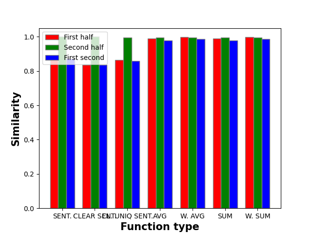

## SENT.
**SCORE:** 2.744

Average similarity for whole column and first half: 0.872
Average similarity for whole column and second half: 1.0
Average similarity for first half and second half: 0.872

## CLEAR SENT.
**SCORE:** 2.674

Average similarity for whole column and first half: 0.837
Average similarity for whole column and second half: 1.0
Average similarity for first half and second half: 0.837

## CL. UNIQ SENT.
**SCORE:** 2.716

Average similarity for whole column and first half: 0.864
Average similarity for whole column and second half: 0.994
Average similarity for first half and second half: 0.859

## AVG
**SCORE:** 2.961

Average similarity for whole column and first half: 0.988
Average similarity for whole column and second half: 0.994
Average similarity for first half and second half: 0.979

## W. AVG
**SCORE:** 2.978

Average similarity for whole column and first half: 0.996
Average similarity for whole column and second half: 0.996
Average similarity for first half and second half: 0.986

## SUM
**SCORE:** 2.961

Average similarity for whole column and first half: 0.988
Average similarity for whole column and second half: 0.994
Average similarity for first half and second half: 0.979

## W. SUM
**SCORE:** 2.978

Average similarity for whole column and first half: 0.996
Average similarity for whole column and second half: 0.996
Average similarity for first half and second half: 0.986

---
## --- Start Column: reg_state1 ---
### SENT.
For reg_state1:
 - whole column and first half: 0.954
 - whole column and second half: 1.0
 - first half and second half: 0.9539999961853027

### CLEAR SENT.
For reg_state1:
 - whole column and first half: 0.938
 - whole column and second half: 1.0
 - first half and second half: 0.9380000233650208

### CL. UNIQ SENT.
For reg_state1:
 - whole column and first half: 0.986
 - whole column and second half: 0.999
 - first half and second half: 0.9850000143051147

### AVG
For reg_state1:
 - whole column and first half: 1.0
 - whole column and second half: 0.998
 - first half and second half: 0.9980000257492065

### W. AVG
For reg_state1:
 - whole column and first half: 1.0
 - whole column and second half: 1.0
 - first half and second half: 1.0

### SUM
For reg_state1:
 - whole column and first half: 1.0
 - whole column and second half: 0.998
 - first half and second half: 0.9980000257492065

### W. SUM
For reg_state1:
 - whole column and first half: 1.0
 - whole column and second half: 1.0
 - first half and second half: 1.0

## --- Start Column: reg_city1 ---
### SENT.
For reg_city1:
 - whole column and first half: 0.941
 - whole column and second half: 1.0
 - first half and second half: 0.9409999847412109

### CLEAR SENT.
For reg_city1:
 - whole column and first half: 0.884
 - whole column and second half: 1.0
 - first half and second half: 0.8840000033378601

### CL. UNIQ SENT.
For reg_city1:
 - whole column and first half: 0.898
 - whole column and second half: 1.0
 - first half and second half: 0.8980000019073486

### AVG
For reg_city1:
 - whole column and first half: 0.999
 - whole column and second half: 0.999
 - first half and second half: 0.9980000257492065

### W. AVG
For reg_city1:
 - whole column and first half: 1.0
 - whole column and second half: 1.0
 - first half and second half: 0.999

### SUM
For reg_city1:
 - whole column and first half: 0.999
 - whole column and second half: 0.999
 - first half and second half: 0.9980000257492065

### W. SUM
For reg_city1:
 - whole column and first half: 1.0
 - whole column and second half: 1.0
 - first half and second half: 0.9990000128746033

## --- Start Column: flight1 ---
### SENT.
For flight1:
 - whole column and first half: 0.839
 - whole column and second half: 1.0
 - first half and second half: 0.8389999866485596

### CLEAR SENT.
For flight1:
 - whole column and first half: 0.88
 - whole column and second half: 1.0
 - first half and second half: 0.8799999952316284

### CL. UNIQ SENT.
For flight1:
 - whole column and first half: 0.88
 - whole column and second half: 1.0
 - first half and second half: 0.8799999952316284

### AVG
For flight1:
 - whole column and first half: 0.999
 - whole column and second half: 1.0
 - first half and second half: 1.0

### W. AVG
For flight1:
 - whole column and first half: 1.0
 - whole column and second half: 1.0
 - first half and second half: 1.0

### SUM
For flight1:
 - whole column and first half: 0.999
 - whole column and second half: 1.0
 - first half and second half: 1.0

### W. SUM
For flight1:
 - whole column and first half: 1.0
 - whole column and second half: 1.0
 - first half and second half: 1.0

## --- Start Column: tail_number1 ---
### SENT.
For tail_number1:
 - whole column and first half: 0.971
 - whole column and second half: 1.0
 - first half and second half: 0.9710000157356262

### CLEAR SENT.
For tail_number1:
 - whole column and first half: 0.982
 - whole column and second half: 1.0
 - first half and second half: 0.9819999933242798

### CL. UNIQ SENT.
For tail_number1:
 - whole column and first half: 0.982
 - whole column and second half: 1.0
 - first half and second half: 0.9819999933242798

### AVG
For tail_number1:
 - whole column and first half: 1.0
 - whole column and second half: 1.0
 - first half and second half: 1.0

### W. AVG
For tail_number1:
 - whole column and first half: 1.0
 - whole column and second half: 1.0
 - first half and second half: 1.0

### SUM
For tail_number1:
 - whole column and first half: 1.0
 - whole column and second half: 1.0
 - first half and second half: 1.0

### W. SUM
For tail_number1:
 - whole column and first half: 1.0
 - whole column and second half: 1.0
 - first half and second half: 1.0

## --- Start Column: reg_expiration1 ---
### SENT.
For reg_expiration1:
 - whole column and first half: 0.988
 - whole column and second half: 1.0
 - first half and second half: 0.9879999756813049

### CLEAR SENT.
For reg_expiration1:
 - whole column and first half: 0.97
 - whole column and second half: 1.0
 - first half and second half: 0.9700000286102295

### CL. UNIQ SENT.
For reg_expiration1:
 - whole column and first half: 0.979
 - whole column and second half: 1.0
 - first half and second half: 0.9789999723434448

### AVG
For reg_expiration1:
 - whole column and first half: 0.999
 - whole column and second half: 1.0
 - first half and second half: 0.9990000128746033

### W. AVG
For reg_expiration1:
 - whole column and first half: 1.0
 - whole column and second half: 1.0
 - first half and second half: 1.0

### SUM
For reg_expiration1:
 - whole column and first half: 0.999
 - whole column and second half: 1.0
 - first half and second half: 0.9990000128746033

### W. SUM
For reg_expiration1:
 - whole column and first half: 1.0
 - whole column and second half: 1.0
 - first half and second half: 1.0

## --- Start Column: reg_owner1 ---
### SENT.
For reg_owner1:
 - whole column and first half: 0.823
 - whole column and second half: 1.0
 - first half and second half: 0.8230000138282776

### CLEAR SENT.
For reg_owner1:
 - whole column and first half: 0.893
 - whole column and second half: 1.0
 - first half and second half: 0.8930000066757202

### CL. UNIQ SENT.
For reg_owner1:
 - whole column and first half: 0.886
 - whole column and second half: 1.0
 - first half and second half: 0.8859999775886536

### AVG
For reg_owner1:
 - whole column and first half: 1.0
 - whole column and second half: 0.999
 - first half and second half: 0.9990000128746033

### W. AVG
For reg_owner1:
 - whole column and first half: 1.0
 - whole column and second half: 1.0
 - first half and second half: 0.999

### SUM
For reg_owner1:
 - whole column and first half: 1.0
 - whole column and second half: 0.999
 - first half and second half: 0.9990000128746033

### W. SUM
For reg_owner1:
 - whole column and first half: 1.0
 - whole column and second half: 1.0
 - first half and second half: 0.9990000128746033

## --- Start Column: manufacturer1 ---
### SENT.
For manufacturer1:
 - whole column and first half: 0.92
 - whole column and second half: 1.0
 - first half and second half: 0.9200000166893005

### CLEAR SENT.
For manufacturer1:
 - whole column and first half: 0.928
 - whole column and second half: 1.0
 - first half and second half: 0.9279999732971191

### CL. UNIQ SENT.
For manufacturer1:
 - whole column and first half: 0.953
 - whole column and second half: 1.0
 - first half and second half: 0.953000009059906

### AVG
For manufacturer1:
 - whole column and first half: 0.996
 - whole column and second half: 0.997
 - first half and second half: 0.9959999918937683

### W. AVG
For manufacturer1:
 - whole column and first half: 1.0
 - whole column and second half: 1.0
 - first half and second half: 1.0

### SUM
For manufacturer1:
 - whole column and first half: 0.996
 - whole column and second half: 0.997
 - first half and second half: 0.9959999918937683

### W. SUM
For manufacturer1:
 - whole column and first half: 1.0
 - whole column and second half: 1.0
 - first half and second half: 1.0

## --- Start Column: model1 ---
### SENT.
For model1:
 - whole column and first half: 0.821
 - whole column and second half: 1.0
 - first half and second half: 0.8209999799728394

### CLEAR SENT.
For model1:
 - whole column and first half: 0.875
 - whole column and second half: 1.0
 - first half and second half: 0.875

### CL. UNIQ SENT.
For model1:
 - whole column and first half: 0.868
 - whole column and second half: 1.0
 - first half and second half: 0.8679999709129333

### AVG
For model1:
 - whole column and first half: 0.999
 - whole column and second half: 0.999
 - first half and second half: 0.9990000128746033

### W. AVG
For model1:
 - whole column and first half: 1.0
 - whole column and second half: 1.0
 - first half and second half: 1.0

### SUM
For model1:
 - whole column and first half: 0.999
 - whole column and second half: 0.999
 - first half and second half: 0.9990000128746033

### W. SUM
For model1:
 - whole column and first half: 1.0
 - whole column and second half: 1.0
 - first half and second half: 1.0

## --- Start Column: Multi Engine2 ---
### SENT.
For Multi Engine2:
 - whole column and first half: 0.965
 - whole column and second half: 1.0
 - first half and second half: 0.9649999737739563

### CLEAR SENT.
For Multi Engine2:
 - whole column and first half: 0.973
 - whole column and second half: 1.0
 - first half and second half: 0.9729999899864197

### CL. UNIQ SENT.
For Multi Engine2:
 - whole column and first half: 1.0
 - whole column and second half: 1.0
 - first half and second half: 1.0

### AVG
For Multi Engine2:
 - whole column and first half: 1.0
 - whole column and second half: 1.0
 - first half and second half: 1.0

### W. AVG
For Multi Engine2:
 - whole column and first half: 1.0
 - whole column and second half: 1.0
 - first half and second half: 1.0

### SUM
For Multi Engine2:
 - whole column and first half: 1.0
 - whole column and second half: 1.0
 - first half and second half: 1.0

### W. SUM
For Multi Engine2:
 - whole column and first half: 1.0
 - whole column and second half: 1.0
 - first half and second half: 1.0

## --- Start Column: Engine Type2 ---
### SENT.
For Engine Type2:
 - whole column and first half: 0.963
 - whole column and second half: 1.0
 - first half and second half: 0.9629999995231628

### CLEAR SENT.
For Engine Type2:
 - whole column and first half: 0.952
 - whole column and second half: 1.0
 - first half and second half: 0.9520000219345093

### CL. UNIQ SENT.
For Engine Type2:
 - whole column and first half: 0.972
 - whole column and second half: 1.0
 - first half and second half: 0.972000002861023

### AVG
For Engine Type2:
 - whole column and first half: 1.0
 - whole column and second half: 1.0
 - first half and second half: 1.0

### W. AVG
For Engine Type2:
 - whole column and first half: 1.0
 - whole column and second half: 1.0
 - first half and second half: 0.999

### SUM
For Engine Type2:
 - whole column and first half: 1.0
 - whole column and second half: 1.0
 - first half and second half: 1.0

### W. SUM
For Engine Type2:
 - whole column and first half: 1.0
 - whole column and second half: 1.0
 - first half and second half: 0.9990000128746033

## --- Start Column: TP mods2 ---
### SENT.
For TP mods2:
 - whole column and first half: 1.0
 - whole column and second half: 1.0
 - first half and second half: 1.0

### CLEAR SENT.
For TP mods2:
 - whole column and first half: 1.0
 - whole column and second half: 1.0
 - first half and second half: 1.0

### CL. UNIQ SENT.
For TP mods2:
 - whole column and first half: 1.0
 - whole column and second half: 0.928
 - first half and second half: 0.9279999732971191

### AVG
For TP mods2:
 - whole column and first half: 1.0
 - whole column and second half: 0.901
 - first half and second half: 0.9010000228881836

### W. AVG
For TP mods2:
 - whole column and first half: 0.998
 - whole column and second half: 0.998
 - first half and second half: 0.993

### SUM
For TP mods2:
 - whole column and first half: 1.0
 - whole column and second half: 0.901
 - first half and second half: 0.9010000228881836

### W. SUM
For TP mods2:
 - whole column and first half: 0.998
 - whole column and second half: 0.998
 - first half and second half: 0.9929999709129333

## --- Start Column: Company2 ---
### SENT.
For Company2:
 - whole column and first half: 0.701
 - whole column and second half: 1.0
 - first half and second half: 0.7009999752044678

### CLEAR SENT.
For Company2:
 - whole column and first half: 0.611
 - whole column and second half: 1.0
 - first half and second half: 0.6110000014305115

### CL. UNIQ SENT.
For Company2:
 - whole column and first half: 0.896
 - whole column and second half: 0.992
 - first half and second half: 0.8790000081062317

### AVG
For Company2:
 - whole column and first half: 0.996
 - whole column and second half: 0.977
 - first half and second half: 0.9559999704360962

### W. AVG
For Company2:
 - whole column and first half: 0.958
 - whole column and second half: 0.969
 - first half and second half: 0.857

### SUM
For Company2:
 - whole column and first half: 0.996
 - whole column and second half: 0.977
 - first half and second half: 0.9559999704360962

### W. SUM
For Company2:
 - whole column and first half: 0.958
 - whole column and second half: 0.969
 - first half and second half: 0.8569999933242798

## --- Start Column: Model2 ---
### SENT.
For Model2:
 - whole column and first half: 0.712
 - whole column and second half: 1.0
 - first half and second half: 0.7120000123977661

### CLEAR SENT.
For Model2:
 - whole column and first half: 0.66
 - whole column and second half: 1.0
 - first half and second half: 0.6600000262260437

### CL. UNIQ SENT.
For Model2:
 - whole column and first half: 0.66
 - whole column and second half: 1.0
 - first half and second half: 0.6600000262260437

### AVG
For Model2:
 - whole column and first half: 0.992
 - whole column and second half: 0.993
 - first half and second half: 0.9679999947547913

### W. AVG
For Model2:
 - whole column and first half: 0.992
 - whole column and second half: 0.993
 - first half and second half: 0.968

### SUM
For Model2:
 - whole column and first half: 0.992
 - whole column and second half: 0.993
 - first half and second half: 0.9679999947547913

### W. SUM
For Model2:
 - whole column and first half: 0.992
 - whole column and second half: 0.993
 - first half and second half: 0.9679999947547913

## --- Start Column: make3 ---
### SENT.
For make3:
 - whole column and first half: 0.97
 - whole column and second half: 1.0
 - first half and second half: 0.9700000286102295

### CLEAR SENT.
For make3:
 - whole column and first half: 0.912
 - whole column and second half: 1.0
 - first half and second half: 0.9120000004768372

### CL. UNIQ SENT.
For make3:
 - whole column and first half: 0.973
 - whole column and second half: 0.996
 - first half and second half: 0.968999981880188

### AVG
For make3:
 - whole column and first half: 0.997
 - whole column and second half: 0.999
 - first half and second half: 0.9950000047683716

### W. AVG
For make3:
 - whole column and first half: 1.0
 - whole column and second half: 1.0
 - first half and second half: 1.0

### SUM
For make3:
 - whole column and first half: 0.997
 - whole column and second half: 0.999
 - first half and second half: 0.9950000047683716

### W. SUM
For make3:
 - whole column and first half: 1.0
 - whole column and second half: 1.0
 - first half and second half: 1.0

## --- Start Column: gear3 ---
### SENT.
For gear3:
 - whole column and first half: 0.93
 - whole column and second half: 1.0
 - first half and second half: 0.9300000071525574

### CLEAR SENT.
For gear3:
 - whole column and first half: 0.966
 - whole column and second half: 1.0
 - first half and second half: 0.9660000205039978

### CL. UNIQ SENT.
For gear3:
 - whole column and first half: 1.0
 - whole column and second half: 1.0
 - first half and second half: 1.0

### AVG
For gear3:
 - whole column and first half: 1.0
 - whole column and second half: 1.0
 - first half and second half: 1.0

### W. AVG
For gear3:
 - whole column and first half: 1.0
 - whole column and second half: 1.0
 - first half and second half: 1.0

### SUM
For gear3:
 - whole column and first half: 1.0
 - whole column and second half: 1.0
 - first half and second half: 1.0

### W. SUM
For gear3:
 - whole column and first half: 1.0
 - whole column and second half: 1.0
 - first half and second half: 1.0

## --- Start Column: model3 ---
### SENT.
For model3:
 - whole column and first half: 0.688
 - whole column and second half: 1.0
 - first half and second half: 0.6880000233650208

### CLEAR SENT.
For model3:
 - whole column and first half: 0.648
 - whole column and second half: 1.0
 - first half and second half: 0.6480000019073486

### CL. UNIQ SENT.
For model3:
 - whole column and first half: 0.762
 - whole column and second half: 1.0
 - first half and second half: 0.7620000243186951

### AVG
For model3:
 - whole column and first half: 0.999
 - whole column and second half: 1.0
 - first half and second half: 0.9990000128746033

### W. AVG
For model3:
 - whole column and first half: 1.0
 - whole column and second half: 1.0
 - first half and second half: 0.999

### SUM
For model3:
 - whole column and first half: 0.999
 - whole column and second half: 1.0
 - first half and second half: 0.9990000128746033

### W. SUM
For model3:
 - whole column and first half: 1.0
 - whole column and second half: 1.0
 - first half and second half: 0.9990000128746033

## --- Start Column: offerType3 ---
### SENT.
For offerType3:
 - whole column and first half: 0.782
 - whole column and second half: 1.0
 - first half and second half: 0.7820000052452087

### CLEAR SENT.
For offerType3:
 - whole column and first half: 0.739
 - whole column and second half: 1.0
 - first half and second half: 0.7390000224113464

### CL. UNIQ SENT.
For offerType3:
 - whole column and first half: 0.985
 - whole column and second half: 0.956
 - first half and second half: 0.9599999785423279

### AVG
For offerType3:
 - whole column and first half: 1.0
 - whole column and second half: 0.957
 - first half and second half: 0.9570000171661377

### W. AVG
For offerType3:
 - whole column and first half: 1.0
 - whole column and second half: 1.0
 - first half and second half: 1.0

### SUM
For offerType3:
 - whole column and first half: 1.0
 - whole column and second half: 0.957
 - first half and second half: 0.9570000171661377

### W. SUM
For offerType3:
 - whole column and first half: 1.0
 - whole column and second half: 1.0
 - first half and second half: 1.0

## --- Start Column: fuel3 ---
### SENT.
For fuel3:
 - whole column and first half: 0.997
 - whole column and second half: 1.0
 - first half and second half: 0.996999979019165

### CLEAR SENT.
For fuel3:
 - whole column and first half: 0.995
 - whole column and second half: 1.0
 - first half and second half: 0.9950000047683716

### CL. UNIQ SENT.
For fuel3:
 - whole column and first half: 0.991
 - whole column and second half: 1.0
 - first half and second half: 0.9909999966621399

### AVG
For fuel3:
 - whole column and first half: 1.0
 - whole column and second half: 1.0
 - first half and second half: 1.0

### W. AVG
For fuel3:
 - whole column and first half: 1.0
 - whole column and second half: 1.0
 - first half and second half: 1.0

### SUM
For fuel3:
 - whole column and first half: 1.0
 - whole column and second half: 1.0
 - first half and second half: 1.0

### W. SUM
For fuel3:
 - whole column and first half: 1.0
 - whole column and second half: 1.0
 - first half and second half: 1.0

## --- Start Column: fuel_type4 ---
### SENT.
For fuel_type4:
 - whole column and first half: 0.975
 - whole column and second half: 1.0
 - first half and second half: 0.9750000238418579

### CLEAR SENT.
For fuel_type4:
 - whole column and first half: 0.961
 - whole column and second half: 0.996
 - first half and second half: 0.9679999947547913

### CL. UNIQ SENT.
For fuel_type4:
 - whole column and first half: 0.993
 - whole column and second half: 1.0
 - first half and second half: 0.9929999709129333

### AVG
For fuel_type4:
 - whole column and first half: 1.0
 - whole column and second half: 1.0
 - first half and second half: 1.0

### W. AVG
For fuel_type4:
 - whole column and first half: 0.999
 - whole column and second half: 0.999
 - first half and second half: 0.995

### SUM
For fuel_type4:
 - whole column and first half: 1.0
 - whole column and second half: 1.0
 - first half and second half: 1.0

### W. SUM
For fuel_type4:
 - whole column and first half: 0.999
 - whole column and second half: 0.999
 - first half and second half: 0.9950000047683716

## --- Start Column: transmission_type4 ---
### SENT.
For transmission_type4:
 - whole column and first half: 0.991
 - whole column and second half: 1.0
 - first half and second half: 0.9909999966621399

### CLEAR SENT.
For transmission_type4:
 - whole column and first half: 0.994
 - whole column and second half: 0.998
 - first half and second half: 0.9940000176429749

### CL. UNIQ SENT.
For transmission_type4:
 - whole column and first half: 0.977
 - whole column and second half: 1.0
 - first half and second half: 0.9769999980926514

### AVG
For transmission_type4:
 - whole column and first half: 1.0
 - whole column and second half: 1.0
 - first half and second half: 1.0

### W. AVG
For transmission_type4:
 - whole column and first half: 0.999
 - whole column and second half: 0.999
 - first half and second half: 0.997

### SUM
For transmission_type4:
 - whole column and first half: 1.0
 - whole column and second half: 1.0
 - first half and second half: 1.0

### W. SUM
For transmission_type4:
 - whole column and first half: 0.999
 - whole column and second half: 0.999
 - first half and second half: 0.996999979019165

## --- Start Column: car_name4 ---
### SENT.
For car_name4:
 - whole column and first half: 0.799
 - whole column and second half: 1.0
 - first half and second half: 0.7990000247955322

### CLEAR SENT.
For car_name4:
 - whole column and first half: 0.635
 - whole column and second half: 1.0
 - first half and second half: 0.6349999904632568

### CL. UNIQ SENT.
For car_name4:
 - whole column and first half: 0.635
 - whole column and second half: 1.0
 - first half and second half: 0.6349999904632568

### AVG
For car_name4:
 - whole column and first half: 0.987
 - whole column and second half: 0.987
 - first half and second half: 0.9490000009536743

### W. AVG
For car_name4:
 - whole column and first half: 0.988
 - whole column and second half: 0.987
 - first half and second half: 0.951

### SUM
For car_name4:
 - whole column and first half: 0.987
 - whole column and second half: 0.987
 - first half and second half: 0.9490000009536743

### W. SUM
For car_name4:
 - whole column and first half: 0.988
 - whole column and second half: 0.987
 - first half and second half: 0.9509999752044678

## --- Start Column: body_type4 ---
### SENT.
For body_type4:
 - whole column and first half: 0.966
 - whole column and second half: 1.0
 - first half and second half: 0.9660000205039978

### CLEAR SENT.
For body_type4:
 - whole column and first half: 0.912
 - whole column and second half: 1.0
 - first half and second half: 0.9120000004768372

### CL. UNIQ SENT.
For body_type4:
 - whole column and first half: 0.968
 - whole column and second half: 0.985
 - first half and second half: 0.9710000157356262

### AVG
For body_type4:
 - whole column and first half: 0.988
 - whole column and second half: 0.993
 - first half and second half: 0.9779999852180481

### W. AVG
For body_type4:
 - whole column and first half: 0.995
 - whole column and second half: 0.995
 - first half and second half: 0.981

### SUM
For body_type4:
 - whole column and first half: 0.988
 - whole column and second half: 0.993
 - first half and second half: 0.9779999852180481

### W. SUM
For body_type4:
 - whole column and first half: 0.995
 - whole column and second half: 0.995
 - first half and second half: 0.9810000061988831

## --- Start Column: vin5 ---
### SENT.
For vin5:
 - whole column and first half: 0.965
 - whole column and second half: 1.0
 - first half and second half: 0.9649999737739563

### CLEAR SENT.
For vin5:
 - whole column and first half: 0.969
 - whole column and second half: 1.0
 - first half and second half: 0.968999981880188

### CL. UNIQ SENT.
For vin5:
 - whole column and first half: 0.969
 - whole column and second half: 1.0
 - first half and second half: 0.968999981880188

### AVG
For vin5:
 - whole column and first half: 0.995
 - whole column and second half: 0.995
 - first half and second half: 0.9800000190734863

### W. AVG
For vin5:
 - whole column and first half: 0.995
 - whole column and second half: 0.995
 - first half and second half: 0.98

### SUM
For vin5:
 - whole column and first half: 0.995
 - whole column and second half: 0.995
 - first half and second half: 0.9800000190734863

### W. SUM
For vin5:
 - whole column and first half: 0.995
 - whole column and second half: 0.995
 - first half and second half: 0.9800000190734863

## --- Start Column: model5 ---
### SENT.
For model5:
 - whole column and first half: 0.749
 - whole column and second half: 1.0
 - first half and second half: 0.7490000128746033

### CLEAR SENT.
For model5:
 - whole column and first half: 0.571
 - whole column and second half: 1.0
 - first half and second half: 0.5709999799728394

### CL. UNIQ SENT.
For model5:
 - whole column and first half: 0.806
 - whole column and second half: 1.0
 - first half and second half: 0.8059999942779541

### AVG
For model5:
 - whole column and first half: 0.987
 - whole column and second half: 0.997
 - first half and second half: 0.9769999980926514

### W. AVG
For model5:
 - whole column and first half: 0.988
 - whole column and second half: 0.987
 - first half and second half: 0.949

### SUM
For model5:
 - whole column and first half: 0.987
 - whole column and second half: 0.997
 - first half and second half: 0.9769999980926514

### W. SUM
For model5:
 - whole column and first half: 0.988
 - whole column and second half: 0.987
 - first half and second half: 0.9490000009536743

## --- Start Column: brand5 ---
### SENT.
For brand5:
 - whole column and first half: 0.824
 - whole column and second half: 1.0
 - first half and second half: 0.8240000009536743

### CLEAR SENT.
For brand5:
 - whole column and first half: 0.707
 - whole column and second half: 1.0
 - first half and second half: 0.7070000171661377

### CL. UNIQ SENT.
For brand5:
 - whole column and first half: 0.433
 - whole column and second half: 1.0
 - first half and second half: 0.43299999833106995

### AVG
For brand5:
 - whole column and first half: 0.702
 - whole column and second half: 1.0
 - first half and second half: 0.7020000219345093

### W. AVG
For brand5:
 - whole column and first half: 0.962
 - whole column and second half: 0.939
 - first half and second half: 0.81

### SUM
For brand5:
 - whole column and first half: 0.702
 - whole column and second half: 1.0
 - first half and second half: 0.7020000219345093

### W. SUM
For brand5:
 - whole column and first half: 0.962
 - whole column and second half: 0.939
 - first half and second half: 0.8100000023841858

## --- Start Column: country5 ---
### SENT.
For country5:
 - whole column and first half: 1.0
 - whole column and second half: 1.0
 - first half and second half: 1.0

### CLEAR SENT.
For country5:
 - whole column and first half: 1.0
 - whole column and second half: 1.0
 - first half and second half: 1.0

### CL. UNIQ SENT.
For country5:
 - whole column and first half: 0.63
 - whole column and second half: 1.0
 - first half and second half: 0.6299999952316284

### AVG
For country5:
 - whole column and first half: 0.821
 - whole column and second half: 1.0
 - first half and second half: 0.8209999799728394

### W. AVG
For country5:
 - whole column and first half: 1.0
 - whole column and second half: 1.0
 - first half and second half: 1.0

### SUM
For country5:
 - whole column and first half: 0.821
 - whole column and second half: 1.0
 - first half and second half: 0.8209999799728394

### W. SUM
For country5:
 - whole column and first half: 1.0
 - whole column and second half: 1.0
 - first half and second half: 1.0

## --- Start Column: condition5 ---
### SENT.
For condition5:
 - whole column and first half: 0.93
 - whole column and second half: 1.0
 - first half and second half: 0.9300000071525574

### CLEAR SENT.
For condition5:
 - whole column and first half: 0.897
 - whole column and second half: 1.0
 - first half and second half: 0.8970000147819519

### CL. UNIQ SENT.
For condition5:
 - whole column and first half: 0.906
 - whole column and second half: 0.997
 - first half and second half: 0.9269999861717224

### AVG
For condition5:
 - whole column and first half: 0.996
 - whole column and second half: 0.998
 - first half and second half: 0.9980000257492065

### W. AVG
For condition5:
 - whole column and first half: 0.999
 - whole column and second half: 0.999
 - first half and second half: 0.996

### SUM
For condition5:
 - whole column and first half: 0.996
 - whole column and second half: 0.998
 - first half and second half: 0.9980000257492065

### W. SUM
For condition5:
 - whole column and first half: 0.999
 - whole column and second half: 0.999
 - first half and second half: 0.9959999918937683

## --- Start Column: title_status5 ---
### SENT.
For title_status5:
 - whole column and first half: 1.0
 - whole column and second half: 1.0
 - first half and second half: 1.0

### CLEAR SENT.
For title_status5:
 - whole column and first half: 1.0
 - whole column and second half: 1.0
 - first half and second half: 1.0

### CL. UNIQ SENT.
For title_status5:
 - whole column and first half: 1.0
 - whole column and second half: 1.0
 - first half and second half: 1.0

### AVG
For title_status5:
 - whole column and first half: 1.0
 - whole column and second half: 1.0
 - first half and second half: 1.0

### W. AVG
For title_status5:
 - whole column and first half: 1.0
 - whole column and second half: 1.0
 - first half and second half: 0.999

### SUM
For title_status5:
 - whole column and first half: 1.0
 - whole column and second half: 1.0
 - first half and second half: 1.0

### W. SUM
For title_status5:
 - whole column and first half: 1.0
 - whole column and second half: 1.0
 - first half and second half: 0.9990000128746033

## --- Start Column: color5 ---
### SENT.
For color5:
 - whole column and first half: 0.958
 - whole column and second half: 1.0
 - first half and second half: 0.9580000042915344

### CLEAR SENT.
For color5:
 - whole column and first half: 0.838
 - whole column and second half: 1.0
 - first half and second half: 0.8379999995231628

### CL. UNIQ SENT.
For color5:
 - whole column and first half: 0.932
 - whole column and second half: 0.964
 - first half and second half: 0.9100000262260437

### AVG
For color5:
 - whole column and first half: 0.995
 - whole column and second half: 0.986
 - first half and second half: 0.9760000109672546

### W. AVG
For color5:
 - whole column and first half: 0.999
 - whole column and second half: 0.999
 - first half and second half: 0.997

### SUM
For color5:
 - whole column and first half: 0.995
 - whole column and second half: 0.986
 - first half and second half: 0.9760000109672546

### W. SUM
For color5:
 - whole column and first half: 0.999
 - whole column and second half: 0.999
 - first half and second half: 0.996999979019165

## --- Start Column: state5 ---
### SENT.
For state5:
 - whole column and first half: 0.792
 - whole column and second half: 1.0
 - first half and second half: 0.7919999957084656

### CLEAR SENT.
For state5:
 - whole column and first half: 0.684
 - whole column and second half: 1.0
 - first half and second half: 0.6840000152587891

### CL. UNIQ SENT.
For state5:
 - whole column and first half: 0.97
 - whole column and second half: 0.999
 - first half and second half: 0.9710000157356262

### AVG
For state5:
 - whole column and first half: 0.998
 - whole column and second half: 0.998
 - first half and second half: 0.9959999918937683

### W. AVG
For state5:
 - whole column and first half: 0.997
 - whole column and second half: 0.997
 - first half and second half: 0.987

### SUM
For state5:
 - whole column and first half: 0.998
 - whole column and second half: 0.998
 - first half and second half: 0.9959999918937683

### W. SUM
For state5:
 - whole column and first half: 0.997
 - whole column and second half: 0.997
 - first half and second half: 0.9869999885559082

## --- Start Column: Poster_Link6 ---
### SENT.
For Poster_Link6:
 - whole column and first half: 0.994
 - whole column and second half: 1.0
 - first half and second half: 0.9940000176429749

### CLEAR SENT.
For Poster_Link6:
 - whole column and first half: 0.99
 - whole column and second half: 1.0
 - first half and second half: 0.9900000095367432

### CL. UNIQ SENT.
For Poster_Link6:
 - whole column and first half: 0.99
 - whole column and second half: 1.0
 - first half and second half: 0.9900000095367432

### AVG
For Poster_Link6:
 - whole column and first half: 1.0
 - whole column and second half: 1.0
 - first half and second half: 1.0

### W. AVG
For Poster_Link6:
 - whole column and first half: 1.0
 - whole column and second half: 1.0
 - first half and second half: 1.0

### SUM
For Poster_Link6:
 - whole column and first half: 1.0
 - whole column and second half: 1.0
 - first half and second half: 1.0

### W. SUM
For Poster_Link6:
 - whole column and first half: 1.0
 - whole column and second half: 1.0
 - first half and second half: 1.0

## --- Start Column: Certificate6 ---
### SENT.
For Certificate6:
 - whole column and first half: 0.922
 - whole column and second half: 1.0
 - first half and second half: 0.921999990940094

### CLEAR SENT.
For Certificate6:
 - whole column and first half: 0.818
 - whole column and second half: 1.0
 - first half and second half: 0.8180000185966492

### CL. UNIQ SENT.
For Certificate6:
 - whole column and first half: 0.927
 - whole column and second half: 0.994
 - first half and second half: 0.9229999780654907

### AVG
For Certificate6:
 - whole column and first half: 0.982
 - whole column and second half: 0.999
 - first half and second half: 0.9769999980926514

### W. AVG
For Certificate6:
 - whole column and first half: 0.998
 - whole column and second half: 0.998
 - first half and second half: 0.99

### SUM
For Certificate6:
 - whole column and first half: 0.982
 - whole column and second half: 0.999
 - first half and second half: 0.9769999980926514

### W. SUM
For Certificate6:
 - whole column and first half: 0.998
 - whole column and second half: 0.998
 - first half and second half: 0.9900000095367432

## --- Start Column: Gross6 ---
### SENT.
For Gross6:
 - whole column and first half: 0.878
 - whole column and second half: 1.0
 - first half and second half: 0.878000020980835

### CLEAR SENT.
For Gross6:
 - whole column and first half: 0.86
 - whole column and second half: 1.0
 - first half and second half: 0.8600000143051147

### CL. UNIQ SENT.
For Gross6:
 - whole column and first half: 0.878
 - whole column and second half: 1.0
 - first half and second half: 0.878000020980835

### AVG
For Gross6:
 - whole column and first half: 1.0
 - whole column and second half: 1.0
 - first half and second half: 0.9990000128746033

### W. AVG
For Gross6:
 - whole column and first half: 1.0
 - whole column and second half: 1.0
 - first half and second half: 0.999

### SUM
For Gross6:
 - whole column and first half: 1.0
 - whole column and second half: 1.0
 - first half and second half: 0.9990000128746033

### W. SUM
For Gross6:
 - whole column and first half: 1.0
 - whole column and second half: 1.0
 - first half and second half: 0.9990000128746033

## --- Start Column: Star46 ---
### SENT.
For Star46:
 - whole column and first half: 0.882
 - whole column and second half: 1.0
 - first half and second half: 0.8820000290870667

### CLEAR SENT.
For Star46:
 - whole column and first half: 0.817
 - whole column and second half: 1.0
 - first half and second half: 0.8169999718666077

### CL. UNIQ SENT.
For Star46:
 - whole column and first half: 0.818
 - whole column and second half: 1.0
 - first half and second half: 0.8180000185966492

### AVG
For Star46:
 - whole column and first half: 0.998
 - whole column and second half: 0.998
 - first half and second half: 0.9940000176429749

### W. AVG
For Star46:
 - whole column and first half: 0.998
 - whole column and second half: 0.998
 - first half and second half: 0.993

### SUM
For Star46:
 - whole column and first half: 0.998
 - whole column and second half: 0.998
 - first half and second half: 0.9940000176429749

### W. SUM
For Star46:
 - whole column and first half: 0.998
 - whole column and second half: 0.998
 - first half and second half: 0.9929999709129333

## --- Start Column: Star26 ---
### SENT.
For Star26:
 - whole column and first half: 0.885
 - whole column and second half: 1.0
 - first half and second half: 0.8849999904632568

### CLEAR SENT.
For Star26:
 - whole column and first half: 0.809
 - whole column and second half: 1.0
 - first half and second half: 0.8090000152587891

### CL. UNIQ SENT.
For Star26:
 - whole column and first half: 0.818
 - whole column and second half: 1.0
 - first half and second half: 0.8180000185966492

### AVG
For Star26:
 - whole column and first half: 0.996
 - whole column and second half: 0.998
 - first half and second half: 0.9890000224113464

### W. AVG
For Star26:
 - whole column and first half: 0.997
 - whole column and second half: 0.997
 - first half and second half: 0.989

### SUM
For Star26:
 - whole column and first half: 0.996
 - whole column and second half: 0.998
 - first half and second half: 0.9890000224113464

### W. SUM
For Star26:
 - whole column and first half: 0.997
 - whole column and second half: 0.997
 - first half and second half: 0.9890000224113464

## --- Start Column: Star16 ---
### SENT.
For Star16:
 - whole column and first half: 0.805
 - whole column and second half: 1.0
 - first half and second half: 0.8050000071525574

### CLEAR SENT.
For Star16:
 - whole column and first half: 0.841
 - whole column and second half: 1.0
 - first half and second half: 0.8410000205039978

### CL. UNIQ SENT.
For Star16:
 - whole column and first half: 0.868
 - whole column and second half: 1.0
 - first half and second half: 0.8679999709129333

### AVG
For Star16:
 - whole column and first half: 0.995
 - whole column and second half: 0.997
 - first half and second half: 0.9860000014305115

### W. AVG
For Star16:
 - whole column and first half: 0.996
 - whole column and second half: 0.996
 - first half and second half: 0.985

### SUM
For Star16:
 - whole column and first half: 0.995
 - whole column and second half: 0.997
 - first half and second half: 0.9860000014305115

### W. SUM
For Star16:
 - whole column and first half: 0.996
 - whole column and second half: 0.996
 - first half and second half: 0.9850000143051147

## --- Start Column: Star36 ---
### SENT.
For Star36:
 - whole column and first half: 0.824
 - whole column and second half: 1.0
 - first half and second half: 0.8240000009536743

### CLEAR SENT.
For Star36:
 - whole column and first half: 0.718
 - whole column and second half: 1.0
 - first half and second half: 0.7179999947547913

### CL. UNIQ SENT.
For Star36:
 - whole column and first half: 0.718
 - whole column and second half: 1.0
 - first half and second half: 0.7179999947547913

### AVG
For Star36:
 - whole column and first half: 0.998
 - whole column and second half: 0.998
 - first half and second half: 0.9919999837875366

### W. AVG
For Star36:
 - whole column and first half: 0.998
 - whole column and second half: 0.998
 - first half and second half: 0.992

### SUM
For Star36:
 - whole column and first half: 0.998
 - whole column and second half: 0.998
 - first half and second half: 0.9919999837875366

### W. SUM
For Star36:
 - whole column and first half: 0.998
 - whole column and second half: 0.998
 - first half and second half: 0.9919999837875366

## --- Start Column: Series_Title6 ---
### SENT.
For Series_Title6:
 - whole column and first half: 0.711
 - whole column and second half: 1.0
 - first half and second half: 0.7110000252723694

### CLEAR SENT.
For Series_Title6:
 - whole column and first half: 0.663
 - whole column and second half: 1.0
 - first half and second half: 0.6629999876022339

### CL. UNIQ SENT.
For Series_Title6:
 - whole column and first half: 0.663
 - whole column and second half: 1.0
 - first half and second half: 0.6629999876022339

### AVG
For Series_Title6:
 - whole column and first half: 0.997
 - whole column and second half: 0.997
 - first half and second half: 0.9890000224113464

### W. AVG
For Series_Title6:
 - whole column and first half: 0.997
 - whole column and second half: 0.997
 - first half and second half: 0.989

### SUM
For Series_Title6:
 - whole column and first half: 0.997
 - whole column and second half: 0.997
 - first half and second half: 0.9890000224113464

### W. SUM
For Series_Title6:
 - whole column and first half: 0.997
 - whole column and second half: 0.997
 - first half and second half: 0.9890000224113464

## --- Start Column: Overview6 ---
### SENT.
For Overview6:
 - whole column and first half: 0.466
 - whole column and second half: 1.0
 - first half and second half: 0.4659999907016754

### CLEAR SENT.
For Overview6:
 - whole column and first half: 0.472
 - whole column and second half: 1.0
 - first half and second half: 0.47200000286102295

### CL. UNIQ SENT.
For Overview6:
 - whole column and first half: 0.472
 - whole column and second half: 1.0
 - first half and second half: 0.47200000286102295

### AVG
For Overview6:
 - whole column and first half: 0.998
 - whole column and second half: 0.998
 - first half and second half: 0.9919999837875366

### W. AVG
For Overview6:
 - whole column and first half: 0.998
 - whole column and second half: 0.998
 - first half and second half: 0.992

### SUM
For Overview6:
 - whole column and first half: 0.998
 - whole column and second half: 0.998
 - first half and second half: 0.9919999837875366

### W. SUM
For Overview6:
 - whole column and first half: 0.998
 - whole column and second half: 0.998
 - first half and second half: 0.9919999837875366

## --- Start Column: Director6 ---
### SENT.
For Director6:
 - whole column and first half: 0.816
 - whole column and second half: 1.0
 - first half and second half: 0.8159999847412109

### CLEAR SENT.
For Director6:
 - whole column and first half: 0.755
 - whole column and second half: 1.0
 - first half and second half: 0.7549999952316284

### CL. UNIQ SENT.
For Director6:
 - whole column and first half: 0.808
 - whole column and second half: 1.0
 - first half and second half: 0.8080000281333923

### AVG
For Director6:
 - whole column and first half: 0.995
 - whole column and second half: 0.996
 - first half and second half: 0.984000027179718

### W. AVG
For Director6:
 - whole column and first half: 0.996
 - whole column and second half: 0.996
 - first half and second half: 0.984

### SUM
For Director6:
 - whole column and first half: 0.995
 - whole column and second half: 0.996
 - first half and second half: 0.984000027179718

### W. SUM
For Director6:
 - whole column and first half: 0.996
 - whole column and second half: 0.996
 - first half and second half: 0.984000027179718

## --- Start Column: Genre6 ---
### SENT.
For Genre6:
 - whole column and first half: 0.954
 - whole column and second half: 1.0
 - first half and second half: 0.9539999961853027

### CLEAR SENT.
For Genre6:
 - whole column and first half: 0.942
 - whole column and second half: 1.0
 - first half and second half: 0.9419999718666077

### CL. UNIQ SENT.
For Genre6:
 - whole column and first half: 0.97
 - whole column and second half: 1.0
 - first half and second half: 0.9700000286102295

### AVG
For Genre6:
 - whole column and first half: 0.999
 - whole column and second half: 0.998
 - first half and second half: 0.996999979019165

### W. AVG
For Genre6:
 - whole column and first half: 0.999
 - whole column and second half: 0.999
 - first half and second half: 0.998

### SUM
For Genre6:
 - whole column and first half: 0.999
 - whole column and second half: 0.998
 - first half and second half: 0.996999979019165

### W. SUM
For Genre6:
 - whole column and first half: 0.999
 - whole column and second half: 0.999
 - first half and second half: 0.9980000257492065

## --- Start Column: show_id7 ---
### SENT.
For show_id7:
 - whole column and first half: 0.927
 - whole column and second half: 1.0
 - first half and second half: 0.9269999861717224

### CLEAR SENT.
For show_id7:
 - whole column and first half: 0.916
 - whole column and second half: 1.0
 - first half and second half: 0.9160000085830688

### CL. UNIQ SENT.
For show_id7:
 - whole column and first half: 0.916
 - whole column and second half: 1.0
 - first half and second half: 0.9160000085830688

### AVG
For show_id7:
 - whole column and first half: 0.997
 - whole column and second half: 0.997
 - first half and second half: 0.9879999756813049

### W. AVG
For show_id7:
 - whole column and first half: 0.997
 - whole column and second half: 0.997
 - first half and second half: 0.988

### SUM
For show_id7:
 - whole column and first half: 0.997
 - whole column and second half: 0.997
 - first half and second half: 0.9879999756813049

### W. SUM
For show_id7:
 - whole column and first half: 0.997
 - whole column and second half: 0.997
 - first half and second half: 0.9879999756813049

## --- Start Column: director7 ---
### SENT.
For director7:
 - whole column and first half: 0.819
 - whole column and second half: 1.0
 - first half and second half: 0.8190000057220459

### CLEAR SENT.
For director7:
 - whole column and first half: 0.79
 - whole column and second half: 1.0
 - first half and second half: 0.7900000214576721

### CL. UNIQ SENT.
For director7:
 - whole column and first half: 0.78
 - whole column and second half: 1.0
 - first half and second half: 0.7799999713897705

### AVG
For director7:
 - whole column and first half: 0.999
 - whole column and second half: 0.998
 - first half and second half: 0.9940000176429749

### W. AVG
For director7:
 - whole column and first half: 0.999
 - whole column and second half: 0.998
 - first half and second half: 0.993

### SUM
For director7:
 - whole column and first half: 0.999
 - whole column and second half: 0.998
 - first half and second half: 0.9940000176429749

### W. SUM
For director7:
 - whole column and first half: 0.999
 - whole column and second half: 0.998
 - first half and second half: 0.9929999709129333

## --- Start Column: title7 ---
### SENT.
For title7:
 - whole column and first half: 0.797
 - whole column and second half: 1.0
 - first half and second half: 0.796999990940094

### CLEAR SENT.
For title7:
 - whole column and first half: 0.698
 - whole column and second half: 1.0
 - first half and second half: 0.6980000138282776

### CL. UNIQ SENT.
For title7:
 - whole column and first half: 0.698
 - whole column and second half: 1.0
 - first half and second half: 0.6980000138282776

### AVG
For title7:
 - whole column and first half: 0.999
 - whole column and second half: 0.999
 - first half and second half: 0.9980000257492065

### W. AVG
For title7:
 - whole column and first half: 0.999
 - whole column and second half: 0.999
 - first half and second half: 0.998

### SUM
For title7:
 - whole column and first half: 0.999
 - whole column and second half: 0.999
 - first half and second half: 0.9980000257492065

### W. SUM
For title7:
 - whole column and first half: 0.999
 - whole column and second half: 0.999
 - first half and second half: 0.9980000257492065

## --- Start Column: description7 ---
### SENT.
For description7:
 - whole column and first half: 0.451
 - whole column and second half: 1.0
 - first half and second half: 0.45100000500679016

### CLEAR SENT.
For description7:
 - whole column and first half: 0.442
 - whole column and second half: 1.0
 - first half and second half: 0.44200000166893005

### CL. UNIQ SENT.
For description7:
 - whole column and first half: 0.442
 - whole column and second half: 1.0
 - first half and second half: 0.44200000166893005

### AVG
For description7:
 - whole column and first half: 0.999
 - whole column and second half: 0.999
 - first half and second half: 0.9959999918937683

### W. AVG
For description7:
 - whole column and first half: 0.999
 - whole column and second half: 0.999
 - first half and second half: 0.996

### SUM
For description7:
 - whole column and first half: 0.999
 - whole column and second half: 0.999
 - first half and second half: 0.9959999918937683

### W. SUM
For description7:
 - whole column and first half: 0.999
 - whole column and second half: 0.999
 - first half and second half: 0.9959999918937683

## --- Start Column: cast7 ---
### SENT.
For cast7:
 - whole column and first half: 0.762
 - whole column and second half: 1.0
 - first half and second half: 0.7620000243186951

### CLEAR SENT.
For cast7:
 - whole column and first half: 0.603
 - whole column and second half: 1.0
 - first half and second half: 0.6029999852180481

### CL. UNIQ SENT.
For cast7:
 - whole column and first half: 0.603
 - whole column and second half: 1.0
 - first half and second half: 0.6029999852180481

### AVG
For cast7:
 - whole column and first half: 0.997
 - whole column and second half: 0.997
 - first half and second half: 0.9890000224113464

### W. AVG
For cast7:
 - whole column and first half: 0.997
 - whole column and second half: 0.997
 - first half and second half: 0.989

### SUM
For cast7:
 - whole column and first half: 0.997
 - whole column and second half: 0.997
 - first half and second half: 0.9890000224113464

### W. SUM
For cast7:
 - whole column and first half: 0.997
 - whole column and second half: 0.997
 - first half and second half: 0.9890000224113464

## --- Start Column: country7 ---
### SENT.
For country7:
 - whole column and first half: 0.924
 - whole column and second half: 1.0
 - first half and second half: 0.9240000247955322

### CLEAR SENT.
For country7:
 - whole column and first half: 0.876
 - whole column and second half: 1.0
 - first half and second half: 0.8759999871253967

### CL. UNIQ SENT.
For country7:
 - whole column and first half: 0.951
 - whole column and second half: 1.0
 - first half and second half: 0.9509999752044678

### AVG
For country7:
 - whole column and first half: 0.999
 - whole column and second half: 0.998
 - first half and second half: 0.9959999918937683

### W. AVG
For country7:
 - whole column and first half: 0.999
 - whole column and second half: 0.998
 - first half and second half: 0.994

### SUM
For country7:
 - whole column and first half: 0.999
 - whole column and second half: 0.998
 - first half and second half: 0.9959999918937683

### W. SUM
For country7:
 - whole column and first half: 0.999
 - whole column and second half: 0.998
 - first half and second half: 0.9940000176429749

## --- Start Column: rating7 ---
### SENT.
For rating7:
 - whole column and first half: 0.926
 - whole column and second half: 1.0
 - first half and second half: 0.9259999990463257

### CLEAR SENT.
For rating7:
 - whole column and first half: 0.923
 - whole column and second half: 1.0
 - first half and second half: 0.9229999780654907

### CL. UNIQ SENT.
For rating7:
 - whole column and first half: 0.985
 - whole column and second half: 0.858
 - first half and second half: 0.8289999961853027

### AVG
For rating7:
 - whole column and first half: 1.0
 - whole column and second half: 0.939
 - first half and second half: 0.9390000104904175

### W. AVG
For rating7:
 - whole column and first half: 0.999
 - whole column and second half: 0.999
 - first half and second half: 0.996

### SUM
For rating7:
 - whole column and first half: 1.0
 - whole column and second half: 0.939
 - first half and second half: 0.9390000104904175

### W. SUM
For rating7:
 - whole column and first half: 0.999
 - whole column and second half: 0.999
 - first half and second half: 0.9959999918937683

## --- Start Column: type7 ---
### SENT.
For type7:
 - whole column and first half: 0.977
 - whole column and second half: 1.0
 - first half and second half: 0.9769999980926514

### CLEAR SENT.
For type7:
 - whole column and first half: 0.99
 - whole column and second half: 1.0
 - first half and second half: 0.9900000095367432

### CL. UNIQ SENT.
For type7:
 - whole column and first half: 1.0
 - whole column and second half: 1.0
 - first half and second half: 1.0

### AVG
For type7:
 - whole column and first half: 1.0
 - whole column and second half: 1.0
 - first half and second half: 1.0

### W. AVG
For type7:
 - whole column and first half: 0.997
 - whole column and second half: 0.997
 - first half and second half: 0.99

### SUM
For type7:
 - whole column and first half: 1.0
 - whole column and second half: 1.0
 - first half and second half: 1.0

### W. SUM
For type7:
 - whole column and first half: 0.997
 - whole column and second half: 0.997
 - first half and second half: 0.9900000095367432

## --- Start Column: listed_in7 ---
### SENT.
For listed_in7:
 - whole column and first half: 0.923
 - whole column and second half: 1.0
 - first half and second half: 0.9229999780654907

### CLEAR SENT.
For listed_in7:
 - whole column and first half: 0.897
 - whole column and second half: 1.0
 - first half and second half: 0.8970000147819519

### CL. UNIQ SENT.
For listed_in7:
 - whole column and first half: 0.898
 - whole column and second half: 1.0
 - first half and second half: 0.8980000019073486

### AVG
For listed_in7:
 - whole column and first half: 0.998
 - whole column and second half: 0.999
 - first half and second half: 0.9959999918937683

### W. AVG
For listed_in7:
 - whole column and first half: 0.998
 - whole column and second half: 0.998
 - first half and second half: 0.994

### SUM
For listed_in7:
 - whole column and first half: 0.998
 - whole column and second half: 0.999
 - first half and second half: 0.9959999918937683

### W. SUM
For listed_in7:
 - whole column and first half: 0.998
 - whole column and second half: 0.998
 - first half and second half: 0.9940000176429749

## --- Start Column: duration7 ---
### SENT.
For duration7:
 - whole column and first half: 0.942
 - whole column and second half: 1.0
 - first half and second half: 0.9419999718666077

### CLEAR SENT.
For duration7:
 - whole column and first half: 0.919
 - whole column and second half: 1.0
 - first half and second half: 0.9190000295639038

### CL. UNIQ SENT.
For duration7:
 - whole column and first half: 0.969
 - whole column and second half: 1.0
 - first half and second half: 0.968999981880188

### AVG
For duration7:
 - whole column and first half: 0.999
 - whole column and second half: 1.0
 - first half and second half: 1.0

### W. AVG
For duration7:
 - whole column and first half: 0.996
 - whole column and second half: 0.996
 - first half and second half: 0.984

### SUM
For duration7:
 - whole column and first half: 0.999
 - whole column and second half: 1.0
 - first half and second half: 1.0

### W. SUM
For duration7:
 - whole column and first half: 0.996
 - whole column and second half: 0.996
 - first half and second half: 0.984000027179718

## --- Start Column: date_added7 ---
### SENT.
For date_added7:
 - whole column and first half: 0.844
 - whole column and second half: 1.0
 - first half and second half: 0.843999981880188

### CLEAR SENT.
For date_added7:
 - whole column and first half: 0.808
 - whole column and second half: 1.0
 - first half and second half: 0.8080000281333923

### CL. UNIQ SENT.
For date_added7:
 - whole column and first half: 0.866
 - whole column and second half: 1.0
 - first half and second half: 0.8659999966621399

### AVG
For date_added7:
 - whole column and first half: 0.995
 - whole column and second half: 0.988
 - first half and second half: 0.9670000076293945

### W. AVG
For date_added7:
 - whole column and first half: 0.99
 - whole column and second half: 0.991
 - first half and second half: 0.961

### SUM
For date_added7:
 - whole column and first half: 0.995
 - whole column and second half: 0.988
 - first half and second half: 0.9670000076293945

### W. SUM
For date_added7:
 - whole column and first half: 0.99
 - whole column and second half: 0.991
 - first half and second half: 0.9610000252723694

