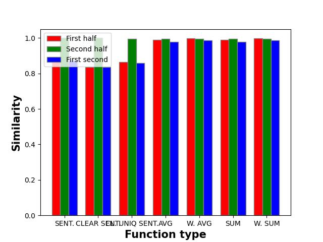

# The result of comparing column2Vec functions

We have tested all functions by 4 criteria that will be explained in the next sections along with results.
We have used only text columns from these tables:
 - /data/aircraft-data_nov_dec.csv
 - /data/Airplane_Cleaned.csv
 - /data/autoscout24-germany-dataset.csv
 - /data/CARS_1.csv
 - /data/USA_cars_datasets.csv
 - /data/imdb_top_1000.csv
 - /data/netflix_titles.csv

## Stability test
> Function should be deterministic and should give the same result for the same input.

We run the function for each column 3 times and then compare results.
### Result:
All functions are stable (give the same result for the same input)
viz. [stability](REP_stability_test.md)

## Partial column test
> When column is spited into two parts A and B, then 
> A should be similar to B and B should be similar to A.
> A should be similar to column and column should be similar to A.
> B should be similar to column and column should be similar to B.

We have split each column into two parts and then compare them with
the original column and with each other.
We have used cosine similarity for comparing. We compute average
similarity for each pair and ve compute overall score by summarizing averages.
### Result:
| Function         | Score | First + column | Second + column | First + Second |
|------------------|-------|----------------|-----------------|----------------|
| W. SUM           | 2.978 | 0.996          | 0.996           | 0.986          |
| W. AVG           | 2.978 | 0.996          | 0.996           | 0.986          |
| SUM              | 2.961 | 0.988          | 0.994           | 0.979          |
| AVG              | 2.961 | 0.988          | 0.994           | 0.979          |
|                  |       |                |                 |                |
| SENTENCE         | 2.744 | 0.872          | 1               | 0.872          |
| ST. CLEAR UNIQUE | 2.716 | 0.864          | 0.994           | 0.859          |
| SENTENCE CLEAR   | 2.674 | 0.837          | 1               | 0.837          |



Best score hase Weighted average and sum functions.
All SUM and AVG functions have very high score and similarity for all parts are balanced.

SENTENCE functions have the lower score, but still it is not bad. 
For same reason First part with whole column and first part with second column have similar
score but Second part with whole column is outstanding.  

Other statistics viz. [partial](REP_partial_column_test.md)

## Time test
> Function should be fast enough to be used in real time.

We have measure time for first run (without cache) for each function

SENTENCE functions are fast enough to be used in real time.
Other functions can are more time-consuming (18 times slower than SENTENCE functions),
but after using cache they are fast enough.

| Function         | Time in seconds | 10 000 columns |
|------------------|-----------------|----------------|
| W. SUM           | 1.247           | 3.46 hours     |
| W. AVG           | 1.301           | 3.61 hours     |
| SUM              | 1.249           | 3.47 hours     |
| AVG              | 1.628           | 4.5 hours      |
|                  |                 |                |
| SENTENCE         | 0.072           | 12 min         |
| ST. CLEAR UNIQUE | 0.068           | 11.3 min       |
| SENTENCE CLEAR   | 0.063           | 10.5 min       |

## Similar and not similar test
> Similar columns should be similar different columns should be different.

We chose 14 random columns: 
```
["reg_state1", "reg_city1", "country5", "country7", "Star46", "Star16",
"make3", "car_name4", "condition5", "date_added7", "fuel_type4", "fuel3",
"flight1", "tail_number1"]
```

And we guess similarity number which could be seen in table below.
Then we compare computed similarities with guessed one.

| Column1      | Column2      | Similar | Num  |
|--------------|--------------|---------|------|
| reg_state1   | reg_city1    | YES     | 0.7  |
| reg_state1   | country5     | YES     | 0.51 |
| reg_state1   | country7     | YES     | 0.51 |
| reg_state1   | condition5   | NO      | 0.35 |
| reg_state1   | date_added7  | NO      | 0.35 |
| reg_state1   | flight1      | NO      | 0.4  |
| reg_state1   | tail_number1 | NO      | 0.4  |
|              |              |         |      |
| reg_city1    | reg_state1   | YES     | 0.7  |
| reg_city1    | country5     | YES     | 0.51 |
| reg_city1    | country7     | YES     | 0.51 |
| reg_city1    | condition5   | NO      | 0.35 |
| reg_city1    | date_added7  | NO      | 0.35 |
| reg_city1    | flight1      | NO      | 0.4  |
| reg_city1    | tail_number1 | NO      | 0.4  |
|              |              |         |      |
| country5     | reg_state1   | YES     | 0.51 |
| country5     | reg_city1    | YES     | 0.51 |
| country5     | country7     | YES     | 0.65 |
| country5     | condition5   | NO      | 0.35 |
| country5     | date_added7  | NO      | 0.35 |
| country5     | flight1      | NO      | 0.4  |
| country5     | tail_number1 | NO      | 0.4  |
|              |              |         |      |
| country7     | reg_state1   | YES     | 0.51 |
| country7     | reg_city1    | YES     | 0.51 |
| country7     | country5     | YES     | 0.65 |
| country7     | condition5   | NO      | 0.35 |
| country7     | date_added7  | NO      | 0.35 |
| country7     | flight1      | NO      | 0.4  |
| country7     | tail_number1 | NO      | 0.4  |
|              |              |         |      |
| star46       | star16       | YES     | 0.75 |
| star46       | condition5   | NO      | 0.35 |
| star46       | date_added7  | NO      | 0.35 |
| star46       | flight1      | NO      | 0.35 |
| star46       | tail_number1 | NO      | 0.35 |
|              |              |         |      |
| star16       | star46       | YES     | 0.75 |
| star16       | condition5   | NO      | 0.35 |
| star16       | date_added7  | NO      | 0.35 |
| star16       | flight1      | NO      | 0.35 |
| star16       | tail_number1 | NO      | 0.35 |
|              |              |         |      |
| make3        | car_name4    | YES     | 0.6  |
| make3        | condition5   | NO      | 0.45 |
| make3        | date_added7  | NO      | 0.45 |
| make3        | flight1      | NO      | 0.45 |
| make3        | tail_number1 | NO      | 0.45 |
|              |              |         |      |
| car_name4    | make3        | YES     | 0.6  |
| car_name4    | condition5   | NO      | 0.35 |
| car_name4    | date_added7  | NO      | 0.35 |
| car_name4    | flight1      | NO      | 0.35 |
| car_name4    | tail_number1 | NO      | 0.35 |
|              |              |         |      |
| condition5   | date_added7  | YES     | 0.6  |
| condition5   | reg_city1    | NO      | 0.35 |
| condition5   | reg_state1   | NO      | 0.35 |
| condition5   | country5     | NO      | 0.35 |
| condition5   | country7     | NO      | 0.35 |
| condition5   | Star46       | NO      | 0.35 |
| condition5   | Star16       | NO      | 0.35 |
| condition5   | make3        | NO      | 0.4  |
| condition5   | car_name4    | NO      | 0.35 |
| condition5   | fuel_type4   | NO      | 0.35 |
| condition5   | fuel3        | NO      | 0.35 |
| condition5   | flight1      | NO      | 0.4  |
| condition5   | tail_number1 | NO      | 0.4  |
|              |              |         |      |
| date_added7  | condition5   | YES     | 0.6  |
| date_added7  | reg_city1    | NO      | 0.35 |
| date_added7  | reg_state1   | NO      | 0.35 |
| date_added7  | country5     | NO      | 0.35 |
| date_added7  | country7     | NO      | 0.35 |
| date_added7  | Star46       | NO      | 0.35 |
| date_added7  | Star16       | NO      | 0.35 |
| date_added7  | make3        | NO      | 0.4  |
| date_added7  | car_name4    | NO      | 0.35 |
| date_added7  | fuel_type4   | NO      | 0.35 |
| date_added7  | fuel3        | NO      | 0.35 |
| date_added7  | flight1      | NO      | 0.4  |
| date_added7  | tail_number1 | NO      | 0.4  |
|              |              |         |      |
| fuel_type4   | fuel3        | YES     | 0.7  |
| fuel_type4   | flight1      | NO      | 0.35 |
| fuel_type4   | condition5   | NO      | 0.35 |
| fuel_type4   | tail_number1 | NO      | 0.35 |
| fuel_type4   | date_added7  | NO      | 0.35 |
|              |              |         |      |
| fuel3        | fuel_type4   | YES     | 0.7  |
| fuel3        | flight1      | NO      | 0.35 |
| fuel3        | condition5   | NO      | 0.35 |
| fuel3        | tail_number1 | NO      | 0.35 |
| fuel3        | date_added7  | NO      | 0.35 |
|              |              |         |      |
| flight1      | tail_number1 | YES     | 0.7  |
|              |              |         |      |
| tail_number1 | flight1      | YES     | 0.7  |

### Result:
We compute scores:
    similar score - the number of correctly determined similar columns
    not similar score - the number of correctly determined not similar columns
    max score: similar columns + not similar columns
    bad - the number of incorrectly determined columns
    SCORE - similar score + not similar score - bad + number of columns
viz. [similar](REP_similar_and_not.md)

Best score is for CLEAR UNIQ SENT. function.

| Function         | SCORE |
|------------------|-------|
| W. SUM           | -10   |
| W. AVG           | -10   |
| SUM              | 6     |
| AVG              | 6     |
|                  |       |
| SENTENCE         | -4    |
| ST. CLEAR UNIQUE | 34    |
| SENTENCE CLEAR   | 14    |

## Conclusion
| Function         | Time in seconds | SIM SCORE | Score part |
|------------------|-----------------|-----------|------------|
| W. SUM           | 1.247           | -10       | 2.978      |
| W. AVG           | 1.301           | -10       | 2.978      |
| SUM              | 1.249           | 6         | 2.961      |
| AVG              | 1.628           | 6         | 2.961      |
|                  |                 |           |            |
| SENTENCE         | 0.072           | -4        | 2.744      |
| ST. CLEAR UNIQUE | 0.068           | 34        | 2.716      |
| SENTENCE CLEAR   | 0.063           | 14        | 2.674      |

If we care more about similarity score then partial score,
and we want faster function, then the best option is CLEAR UNIQ SENTENCE function

If we care more about partial score then similarity score and time is not so important for us,
then the best options are SUM and AVG functions.