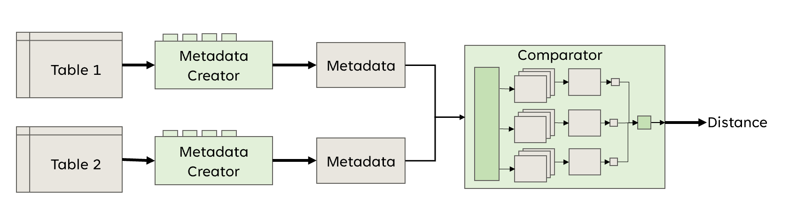
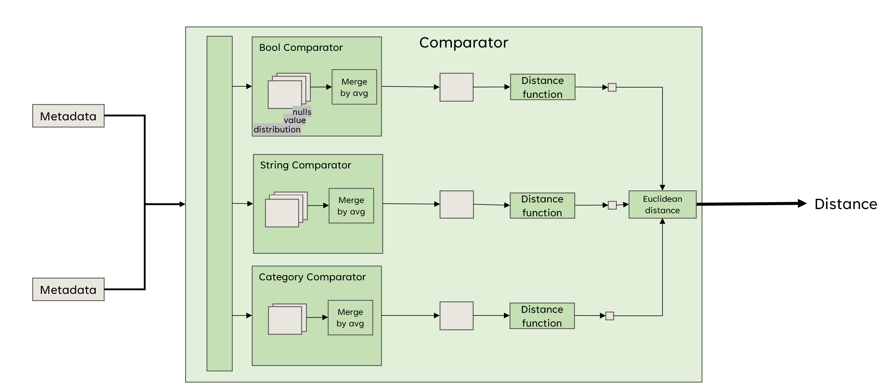
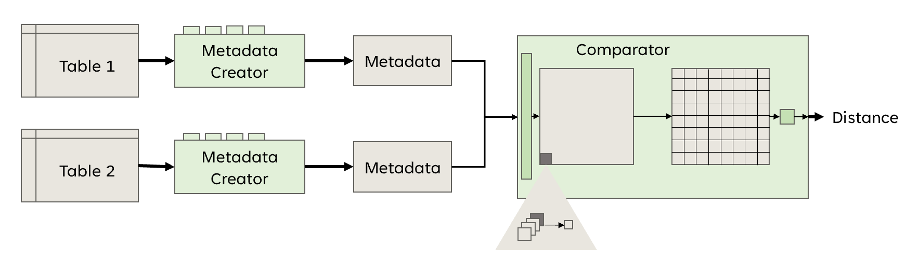

### File Types.py 
The file Types.py includes a Type class and functions
that can be used to determine the type of each column in a dataset.

### File DataFrameMetadata.py
Contains Metadata Class and CategoricalMetadata class

### File DataFrameMetadataCreator.py
Contains MetadataCreator to create Metadata

# Structure
## folder [comparing_all_tables](comparing_all_tables) 
This folder contains two files categorical.ipynb and comparing.py.
File comparing.py contains the first version of Comparator.
Comparator compares all the tables together,
so it is constructed by nested loops.
It is very complicated, it has not a good design, and
we do not recommend to use it. 

File categorical.ipynb shows usage of comparing.py

## file Comparator.py
File contains Comparator class ComparatorType classes and DistanceFunction
Comparator is part of the pipeline that is shown below

You can se the implementation of Comparator in the picture below.
The user sets several specific comparators for comparator
(for example, bool, string and category)
Each comparator will be executed.
Specific comparator creates a number of distance tables for all bool columns. 
Then these tables are merged by counting average for each cell.
That will create one distance table for bool this table will be passed to
Distance function together with a weight and table ratio, and it will count number.
All numbers will be passed to Euclidean distance and the overall distance will be computed.

This comparator is used in main.py, test.ipynb and test_comparator.py

### File test.ipynb
The file test.ipynb contains usage example of MetadataCreator class and 
Comparator class. It also shows heatmaps and accuracy scores.

# file ComparatorByColumns

### todo 
- categorical.ipynb,
- Datasets_Desription.ipynb,
- functions.ipynb,
- playground.ipynb

---
- functions.py
- comparing.py
- ComparatorByColumn.py

